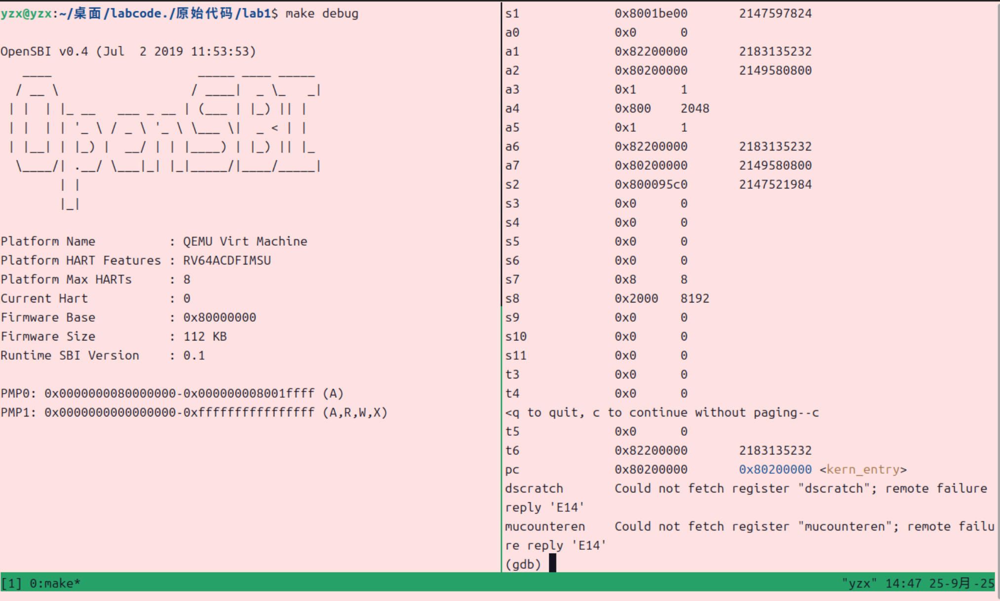
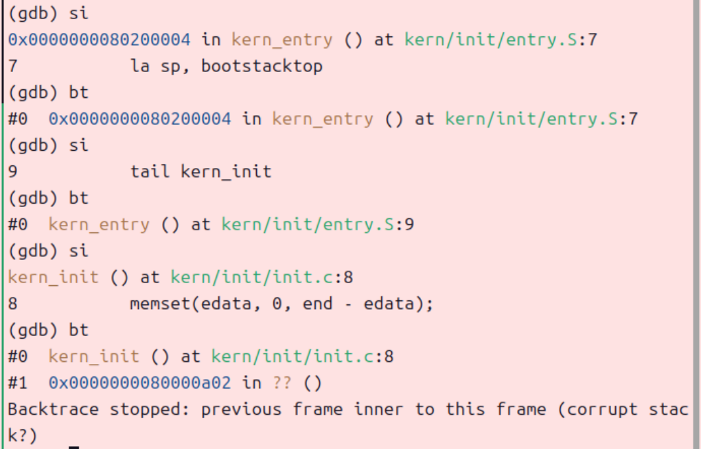
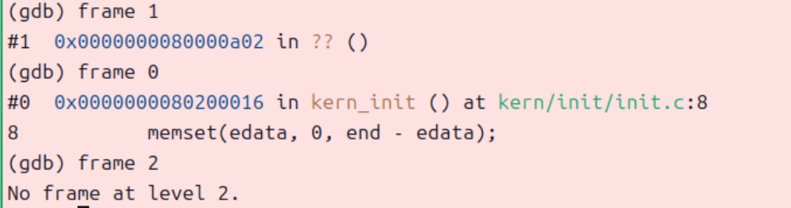
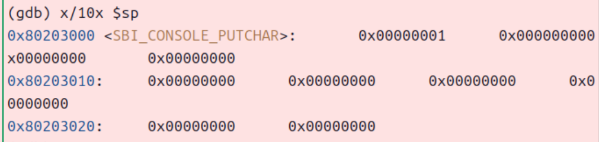
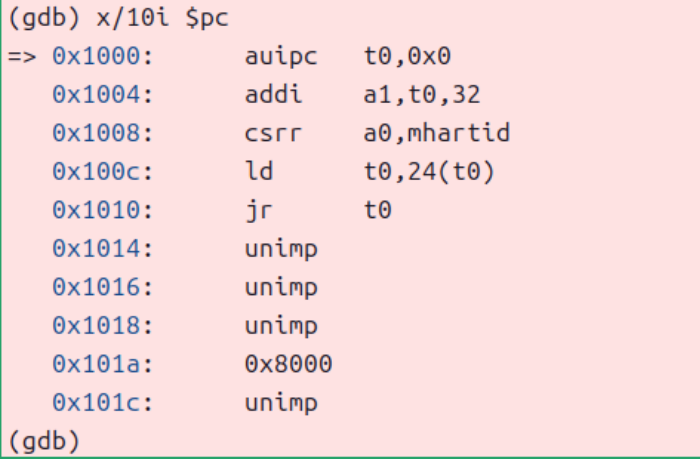
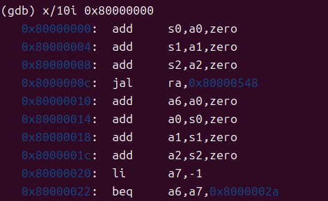
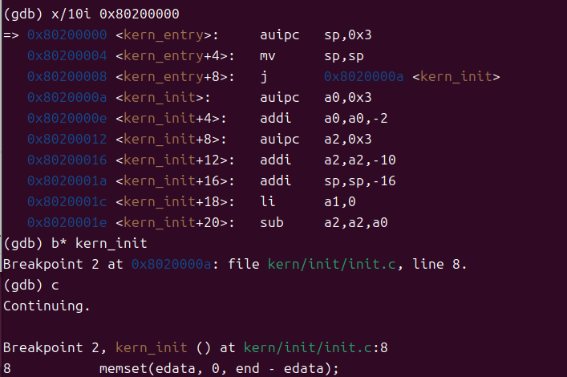

<h1 align='center'>操作系统实验报告
<h4 align='center'>信息安全		 2313781 李胜林	2312796 张肇秋	2312323 杨中秀
  
## 一、配置实验环境	

这个部分比较繁琐，但步骤相对简单，根据实验文档，遇到不会的就去查阅资料就可以了，因此在这里便不再赘述。在配置完环境之后，我们输入

```markdown
riscv64-unknown-elf-gcc -v
qemu-system-riscv64 --version
```

两个指令即可查看gcc和qemu的版本，得到的版本信息如下：


## 二、最小可执行内核

### （一）运行ucore内核

​	我们在命令行中输入`make qemu`运行ucore内核，其运行结果如下图所示：


​	我们会看到`(THU.CST) os is loading`这条语句，说明内核已经开始运行了。

  为更细化地了解ucore内核启动过程中执行的操作，我们接下来使用GDB调试，一步步监控过程中寄存器的变化与执行的语句的情况。

### （二）GDB调试

​	在使用gdb工具前，我们需要安装一个tmux工具用于查看两个界面，输入`sudo qpt install tmux`即可完成安装。

​	随后我们开始进行调试，首先在左侧界面输入`make debug`，右侧界面输入`make gdb`，即可进入以下界面：


#### 查看硬件加电最初指令的位置

​	这说明我们的调试工作开始了，随后我们输入`target remote:1234`和`info registers pc`,从而建立GDB与Qemu调试器的链接并显示pc寄存器的值，然后我们先输入`x/10i $pc`以查看从现在开始往后的10条汇编指令，这些指令便是硬件加电后最初执行的几条指令的位置，其结果如下图所示：


​	其中比较重要的就是前5条汇编指令

```assembly
auipc	tp,0x0
addi	a1,to,32
csrr	a0.mhartid
ld		to,24(t0)
jr		t0
```

​	随后我们会进行说明，现在我们着重展现调试过程。

#### 查看一些其他的信息

##### 查看所有寄存器的信息

​	随后我们输入` b* kern_entry`添加断点，随后输入`c`执行到断点的位置，我们发现debug界面也发生了变化，如图所示：



​	在这张图中，我们在右侧输入了`i r`用以查看所有寄存器的值。

#####  查看kern_entry和kern_init的汇编代码

​	我们输入`disassemble kern_entry`和`disassemble kern_init`即可获得两个文件的汇编代码如下所示：

**kern_entry**:

```assembly
0x000000080200000 <+0>:  aujpc  sp, 0x3        ; 将 sp 设置为 PC + (0x3 << 12)，用于设置初始栈指针
0x000000080200004 <+4>:  mv     sp, sp         
0x000000080200008 <+8>:  j      0x802000aa <kern_init>  ; 无条件跳转到 kern_init 函数
```

**kern_init**:

```assembly
0x00000008020000a <+0>:   autpc   a0, 0x3           ; 获取 PC 高20位，用于构造地址
0x00000008020000e <+4>:   addi    a0, a0, -2        ; 计算地址
0x000000080200012 <+8>:   autpc   a2, 0x3           ; 再次获取 PC 高20位
0x000000080200016 <+12>:  addi    a2, a2, -10       ; 计算地址
0x00000008020001a <+16>:  addi    sp, sp, -16       ; 在栈上分配16字节空间
0x00000008020001c <+18>:  li      a1, 0             ; 设置 memset 的填充值为 0
0x00000008020001e <+20>:  sub     a2, a2, a0        ; 计算 memset 的长度（结束地址 - 起始地址）
0x000000080200020 <+22>:  sd      ra, 8(sp)         ; 保存返回地址到栈上
0x000000080200022 <+24>:  jal     ra, 0x802004b6 <memset>  ; 调用 memset 清空 .bss 段
0x000000080200026 <+28>:  autpc   a1, 0x0           ; 获取字符串地址高位
0x00000008020002a <+32>:  addi    a1, a1, 1186      ; 计算字符串地址
0x00000008020002e <+36>:  autpc   a0, 0x0           ; 获取格式字符串地址高位
0x000000080200032 <+40>:  addi    a0, a0, 1210      ; 计算格式字符串地址
0x000000080200036 <+44>:  jal     ra, 0x80200056 <cprintf>  ; 调用 cprintf 输出欢迎信息
0x00000008020003a <+48>:  j       0x8020003a <kern_init+48> ; 死循环，内核初始化完成后挂起
```

##### 单步调试并查看函数调用栈

​	我们在执行到断点的位置后，便可以进行单步调试`si`并查看函数调用栈中的信息`bt`了，如下所示：



​	我们可以看到，随着代码的执行，函数调用栈中的信息从无到有一个`kern_init()`再到有另一个仅有地址的位置函数。

##### 切换函数调用栈

​	在上一步单步执行到一定程度之后，我们变可以通过`frame 0`、`frame 1`等切换函数调用栈，如下图所示：



​	我们可以看到仅能切换两个函数调用栈（因为仅有调用了两个函数），与我们之前单步执行时相同观察到的函数调用栈中的信息相同。

##### 查看栈中的内容

​	我们输入`x/10x $sp`可以以十六进制显示栈指针后的10个字，如下图所示：



#### 内核启动

​	我们继续输入`c`即可使程序绕过断点继续执行，在这个时候便会输出`(THU.CST) os is loading`。随后便与实验指导文档中所说的一样，成功启动了内核

### （三）练习解答

#### 练习1：理解内核启动中的程序入口操作

​	阅读 kern/init/entry.S内容代码，结合操作系统内核启动流程，说明指令 la sp, bootstacktop 完成了什么操作，目的是什么？ tail kern_init 完成了什么操作，目的是什么？

​	我认为在系统内核启动的过程中，` la sp, bootstacktop`是**将bootstacktop的地址加载到栈指针寄存器sp**，而`tail kern_init`是**跳转到kern_init函数**，这里的tail与普通的call不同，它不会保存返回地址和建立栈帧。这段代码的**目的**是设置好内核栈指针，保存函数调用的返回地址、局部变量和函数参数等状态信息，在内核正式执行前准备好执行环境，以确保后续的kern_init等C函数能够正确运行，然后直接跳转到内核初始化函数，实现了控制权从底层汇编代码向内核初始化的转移。

#### 练习2: 使用GDB验证启动流程

​	RISC-V 硬件加电后最初执行的几条指令位于什么地址？它们主要完成了哪些功能？

​	RISC-V硬件加电后第一阶段执行的指令从0x1000处开始，如下图所示，完成了硬件上电、初始化和固件启动的工作:



​	其主要代码为：

```
auipc	tp,0x0	#将当前PC值的高20位与立即数0组合，存入tp寄存器
addi	a1,to,32	#将tp的值加上32存入a1寄存器
csrr	a0.mhartid	#读取mhartid CSR（控制和状态寄存器），获取当前硬件线程ID
ld		to,24(t0)	#从tp+24的内存地址加载64位值到t0寄存器
jr		t0	#跳转到t0寄存器指定的地址
```


​	这几条指令完成了RISC-V系统加电后的硬件初始化，并跳转到主引导程序继续执行。

RISC-V硬件加电后的第二阶段执行的指令从0x80000000处开始，其部分代码如下图所示，完成了OpenSBI初始化与内核加载等工作：



该阶段主要完成了OpenSBI在RISC-V机器模式下的运行、初始化处理器运行环境和系统控制状态寄存器（同时保存a0、a1、a2等参数随后进行函数调用），设置中断处理、内存保护等底层机制，准备加载操作系统内核的环境，加载内核镜像至0x80200000等工作。

RISC-V硬件加电后的第三阶段执行的指令从0x80200000处开始，其代码如下图所示，完成了内核启动执行等工作：



  其主要代码为：
```
auipc   sp,0x3                  #计算栈顶地址，调整栈指针
mv      sp,sp                   #或许是手动加上的阻塞以确保流水线效率
j       0x8020000a <kern_init>  #跳转到kern_init函数，进行c代码的内存初始化
auipc   a0,0x3                  #传参，a0<-PC+ox3000
addi    a0,a0,-2                #得到edata的地址
auipc   a2,0x3                  #传参，a2<-PC+ox3000
addi    a2,a2,0d-10             #end的地址（0x80203008）
addi    sp,sp,-16               #开辟栈帧
li      a1,0                    #设置参数初始值
sub     a2,a2,a0
```
上述代码主要实现了从 kern_entry 开始执行内核代码，设置内核栈指针，为C语言函数调用准备栈空间，跳转到 kern_init 函数进入内核主初始化流程，并对内核数据段进行必要的初始化。
以上三级启动的流程实现了操作系统从最底层的硬件初始化到高层操作系统内核的平滑过渡，每一级都为下一级准备了必要的执行环境。

