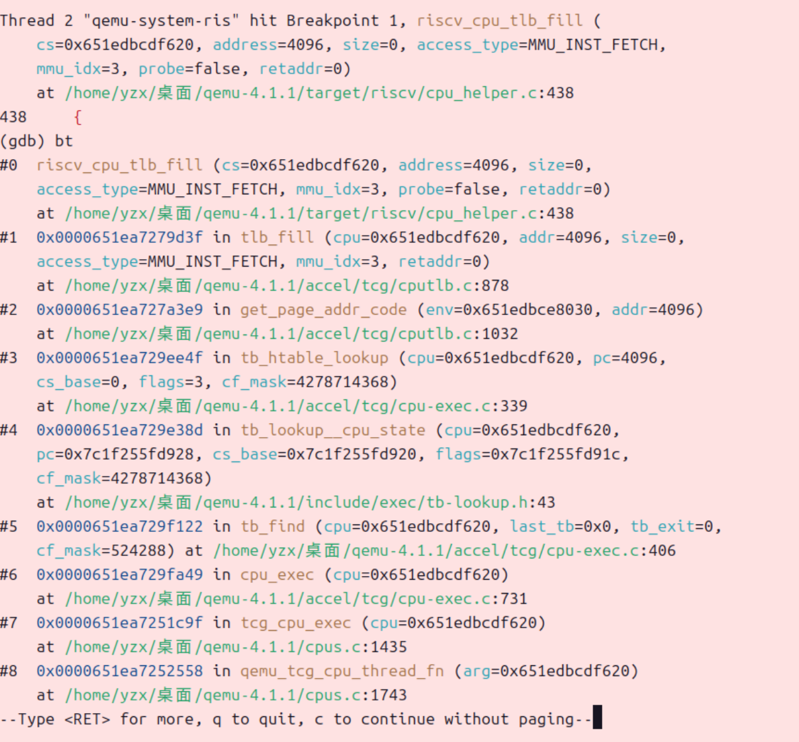
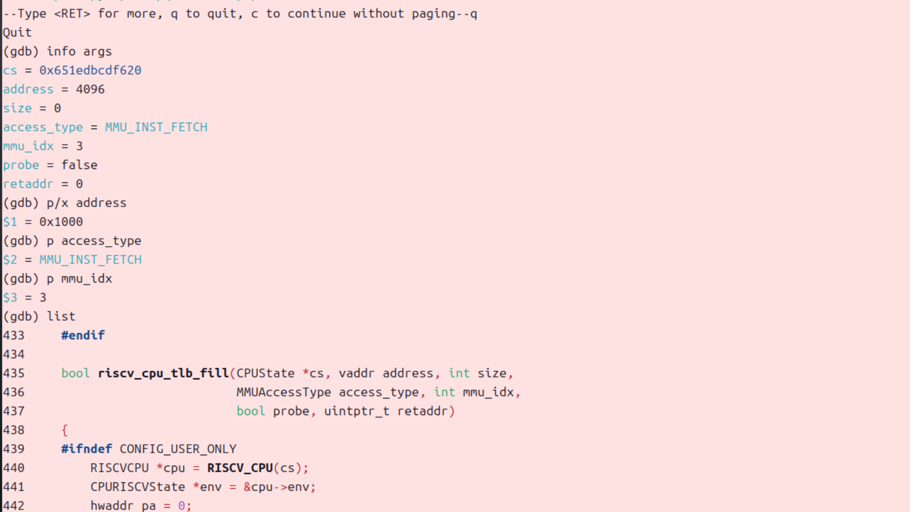
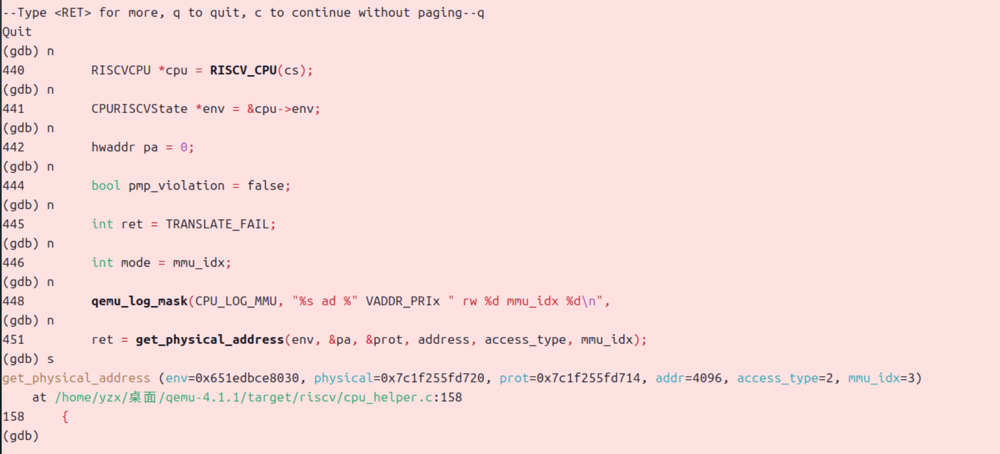
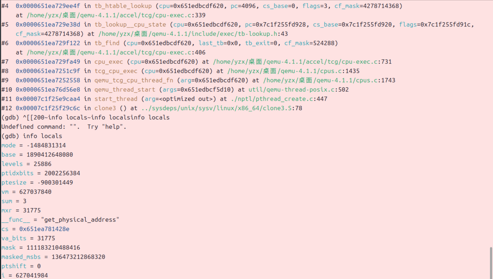
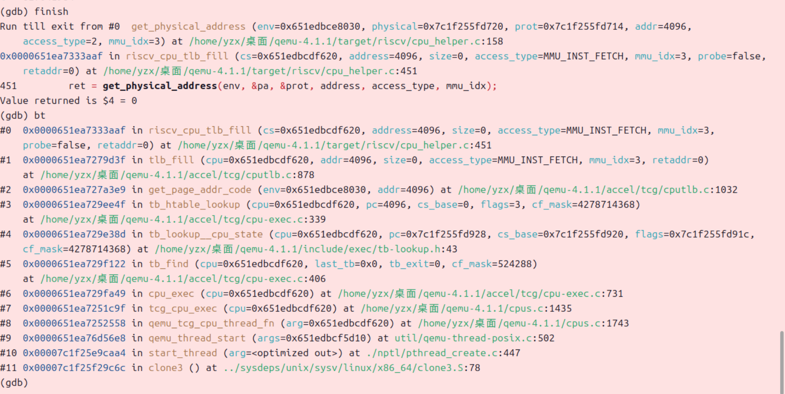

<h1 align='center'>Lab2—SideStory:gdb调试页表查询过程

<h4 align='center'>李胜林	张肇秋	杨中秀

## 一、实验流程

### 终端1

​	打开终端1`make debug`

### 终端2

​	打开终端2，输入`pgrep -f qemu-system-riscv64` 查pid，然后

```
sudo gdb /home/yzx/桌面/qemu-4.1.1/riscv64-softmmu/qemu-system-riscv64
```

 	attach (查到的pid)
 	handle SIGPIPE nostop noprint
 	b riscv_cpu_tlb_fill
 	c

### 终端3

​	打开终端3make gdb ，`b kern_entry`，c

### 调试开始

​	看终端2（`riscv_cpu_tlb_fill`断点这个）:

#### 找到断点`riscv_cpu_tlb_fill`的对应位置

```apl
(gdb) bt              # 1. 调用栈：谁调用 riscv_cpu_tlb_fill
(gdb) info args       # 2. 当前函数的实参
(gdb) p/x address     # 3. 虚拟地址（这次翻译的 VA）
(gdb) p access_type   # 4. 访问类型（取指 / 读 / 写）
(gdb) p mmu_idx       # 5. 当前 MMU 模式（用户/内核
(gdb) list            # 默认显示当前附近 10 行
(gdb) list 438,480    # 多看几行
```

##### 查看相应的信息





#### 找到调用函数`get_physical_address()`的位置

```apl
(gdb) n   				#没找到就一直输入n下一步
(gdb) s					#找到后输入s进入
(gdb) n                 # 一行一行走
(gdb) p/x base
(gdb) p level
(gdb) p/x idx
(gdb) p/x pte
#（这三个循环分别处理 SV39 的三级页表，每一层根据虚拟地址的不同字段计算索引 idx，从当前页表页 base 中取出对应的 PTE，再判断是否叶子页 / 是否有效）
```

##### 查找到相应的信息





#### 三次循环，分别寻找SV0、SV1、SV2三级页表

```apl
(gdb) finish      # 也可以用 finish 快速跑到当前函数返回处
(gdb) bt          # 看看栈回到了 riscv_cpu_tlb_fill
#完成从一次访存 → TLB miss → 页表遍历 → 填 TLB
```



## 二、调试要求

1. 尝试理解我们调试流程中涉及到的qemu的源码，给出关键的调用路径，以及路径上一些**关键的分支语句（不是让你只看分支语句）**，并通过调试演示某个访存指令访问的虚拟地址是**如何在qemu的模拟中被翻译成一个物理地址的**。（`get_physical_address`）

   通用的 `tlb_fill` 会再调用 RISC-V 专用的

```C++
riscv_cpu_tlb_fill(CPURISCVState *env,
                   target_ulong address,
                   int size,
                   MMUAccessType access_type,
                   int mmu_idx,
                   bool probe,
                   uintptr_t retaddr);
```

​	`riscv_cpu_tlb_fill` 内部调用 `get_physical_address` 做页表遍历。在 `cpu_helper.c` 里，`riscv_cpu_tlb_fill` 会根据 `satp`、`mmu_idx`、`access_type` 等信息决定是否需要分页翻译，然后调用类似：

```C++
get_physical_address(env, &pa, &prot, address,
                     access_type, mmu_idx);
```

​	这里 `address` 是虚拟地址，`pa` 输出物理地址，`prot` 输出读写/可执行权限标志。

​	如果 `get_physical_address` 成功，`riscv_cpu_tlb_fill` 再调用

```C++
tlb_set_page(cpu, address, pa, prot, mmu_idx, target_page_size);
```

​	在 QEMU 的软件 TLB 数组里记录一条虚拟页号到物理页帧号映射。

2. 单步调试页表翻译的部分，解释一下关键的操作流程。

​	`get_physical_address`

+ 解析 satp 寄存器，拿到根页表基址
+ 从虚拟地址拆出 VPN[2:0] 和页内偏移
+ 多级页表遍历
+ 构造最终的物理页帧号 + 物理地址
+ 权限检查最后一步用 `access_type`（读/写/取指）、`mmu_idx`（当前特权级）和 PTE 的权限位（`R/W/X/U`）一起判断：是否允许用户态访问、是否允许执行、是否允许写入、是否需要触发页权限异常。
+ 返回给 `riscv_cpu_tlb_fill`：如果所有检查通过，就把 `paddr` 和权限 `prot` 返回；如果某个检查失败，就通过异常机制告诉上层需要产生 page fault。

3. 是否能够在qemu-4.1.1的源码中找到模拟cpu查找tlb的C代码，通过调试说明其中的细节。(前面已经说了)

​	`riscv_cpu_tlb_fill`:在 TLB miss 时，根据虚拟地址、访问类型等去查页表，如果成功则调用 `tlb_set_page` 把映射加入 QEMU 的 TLB。

​	`get_physical_address`:负责 SV39 多级页表遍历，把虚拟地址翻译成物理地址，同时检查权限。

​	`tlb_set_page`:把刚算出来的物理地址及属性写入 `CPUState` 中的 TLB 表（一般是二维数组，第一维是 `mmu_idx`，第二维是某个 hash/索引）。

4. 仍然是tlb，qemu中模拟出来的tlb和我们真实cpu中的tlb有什么**逻辑上的区别**

​	真实CPU的TLB是一个高速、并行、时序敏感的硬件结构；
​	QEMU的TLB是用 C 结构体和数组实现的“功能等价模型”，只保证地址翻译结果正确，不追求硬件级别的延迟、容量和替换策略的精确模拟。


