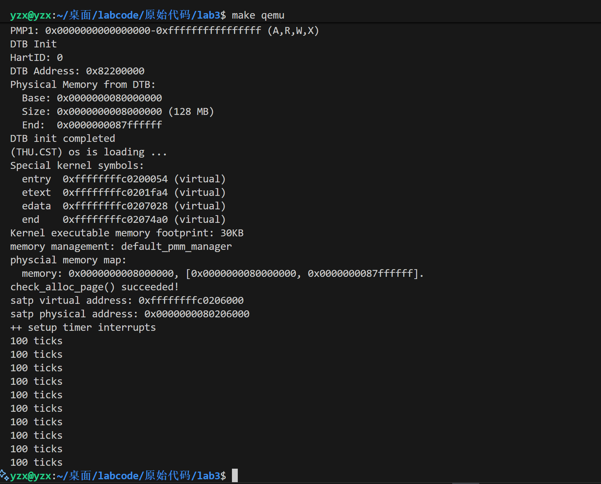
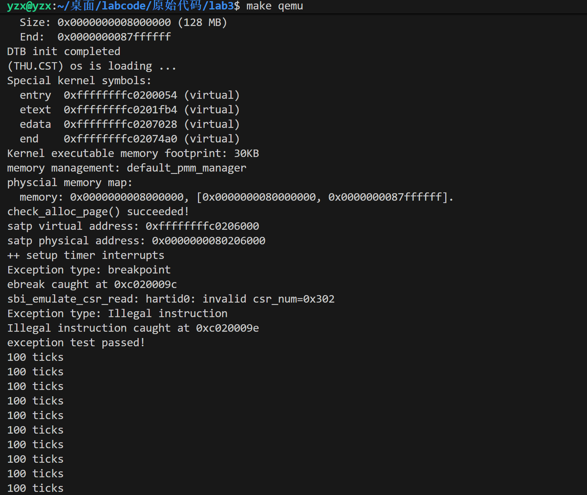

<h1 align='center'>操作系统实验报告

<h2 align='center'>Lab3:中断与中断处理流程

<h4 align='center'>信息安全		2313781 李胜林		2312796 张肇秋		2312323 杨中秀

## 一、实验目的

​	实验3主要讲解的是中断处理机制。进行本次实验的目的主要是学习riscv的中断相关知识，掌握中断前后如何进行上下文环境的保存与恢复，了解一些基本的中断的分发与处理方式，最后实现对最简单断点中断和时钟中断的处理。

## 二、实验内容

​	通过本章的学习，我们了解了 `riscv`的中断处理机制、相关寄存器与指令。我们知道在中断前后需要恢复上下文环境，用一个名为中断帧（`TrapFrame`）的结构体存储了要保存的各寄存器，并用了很大篇幅解释如何通过精巧的汇编代码实现上下文环境保存与恢复机制。最终，我们通过处理断点和时钟中断验证了我们正确实现了中断机制。

## 三、练习

### （一）练习1：完善中断处理 

​	请编程完善`trap.c`中的中断处理函数`trap`，在对时钟中断进行处理的部分填写`kern/trap/trap.c`函数中处理时钟中断的部分，使操作系统每遇到100次时钟中断后，调用`print_ticks`子程序，向屏幕上打印一行文字”`100 ticks`”，在打印完10行后调用`sbi.h`中的`shut_down()`函数关机。

​	要求完成问题1提出的相关函数实现，提交改进后的源代码包（可以编译执行），并在实验报告中简要说明实现过程和定时器中断中断处理的流程。实现要求的部分代码后，运行整个系统，大约每1秒会输出一次”100 ticks”，输出10行。

### （二）扩展练习 Challenge1：描述与理解中断流程

​	回答：描述`ucore`中处理中断异常的流程（从异常的产生开始），其中`mov a0，sp`的目的是什么？`SAVE_ALL`中寄寄存器保存在栈中的位置是什么确定的？对于任何中断，`__alltraps` 中都需要保存所有寄存器吗？请说明理由。

### （三）扩展练习 Challenge2：理解上下文切换机制

​	回答：在`trapentry.S`中汇编代码` csrw sscratch, sp`；`csrrw s0, sscratch, x0`实现了什么操作，目的是什么？`save all`里面保存了`stval scause`这些`csr`，而在`restore all`里面却不还原它们？那这样store的意义何在呢？

### （四）扩展练习Challenge3：完善异常中断

​	编程完善在触发一条非法指令异常` mret`和，在 `kern/trap/trap.c`的异常处理函数中捕获，并对其进行处理，简单输出异常类型和异常指令触发地址，即“`Illegal instruction caught at 0x(地址)`”，“`ebreak caught at 0x（地址）`”与“`Exception type:Illegal instruction`"，“`Exception type: breakpoint`”。

## 四、练习解答

### （一）练习1：完善中断处理

​	在这个部分中，我们主要是完善`trap.c`中的部分代码，剩余的一部分会在扩展练习3中实现。这一部分实现的代码主要就是让函数在处理时钟中断的过程可视化，即我们每隔一定次数（`TICK_NUM`）的时钟中断输出一次提示信息`100 ticks`，然后在打印了10行之后就通过调用系统函数来退出程序。

​	这个功能的实现比较简单，我们只需要在对应的地方输入几行代码就可以了，具体情况如下所示：

​	我们首先要在函数`include`处添加一个新的头文件`sbi.h`，以确保sbi_shutdown函数能在处理过程中成功调用，然后在程序开头声明我们的静态变量`num`用于记录打印次数：

```c
static size_t num = 0;
```

​	随后我们在`interrupt_handler`函数的`case IRQ_S_TIMER:`处补全代码

```c++
            /* LAB3 EXERCISE1   2312323 :  */
            /*(1)设置下次时钟中断- clock_set_next_event()
             *(2)设置下次时钟中断
             *(3)当计数器加到100的时候，我们会输出一个`100ticks`表示我们触发了100次时钟中断，同时打印次数（num）加一
            * (4)判断打印次数，当打印次数为10时，调用<sbi.h>中的关机函数关机
            */
            clock_set_next_event();//设置下次时钟中断
            ticks++;//设置下次时钟中断
            if(ticks%TICK_NUM==0){//当计数器加到100的时候，我们会输出一个`100ticks`
                print_ticks();
                num++;
                if(num==10){
                    sbi_shutdown();//判断打印次数，当打印次数为10时，调用<sbi.h>中的关机函数关机
                    
                }
            }
            break;
```

​	这样就实现了我们想要的功能，其运行结果如下所示:



​	我们成功输出了10个间隔时间一定的`100 ticks`，说明这个练习我们就完成了！

### （二）扩展练习 Challenge1：描述与理解中断流程

#### 1.ucore处理中断异常的流程

​	我们认为ucore处理中断异常分为五个阶段，从硬件事件或软件错误触发中断异常开始，之后经历保存当前运行状态，处理异常事件，恢复中断前的运行状态、程序继续进行先前的操作的四个状态。

##### 中断异常产生

​	当CPU检测到中断、异常产生时，硬件会进行以下操作：首先判断特权级，判断当前的程序是执行在用户态还是执行在内核运行态。随后，会将一些关键寄存器的信息保存下来，这些寄存器包括：

+ `sstatus`寄存器(Supervisor Status Register),它会保存当前状态，其中包含诸如sstatus.SIE(Supervisor Interupt Enable),sstatus.UIE(User Interupt Enable),sstatus.SPIE(Supervisor Previous Interupt Enable),sstatus.SPP(Supervisor previous privilege)等重要字段。
+ `sepc`(Supervisor exception program counter)，它会记录触发中断的那条指令的地址。
+ `scause`，它会记录中断发生的原因，还会记录该中断是不是一个外部中断(interrupt)，其中，当其最高位为1时，代表为interrupt，当其最高位为0时，代表为exception。
+ `stval`，它会记录一些中断处理所需要的辅助信息，比如指令获取(instruction fetch)、访存、缺页异常，它会把发生问题的目标地址或者出错的指令记录下来，这样我们在中断处理程序中就知道处理目标了。

​	随后会检测当前所处的状态，若处于用户态的话，则自动切换到内核态。接着会根据`stvec`寄存器的值，跳转到预定义的汇编入口`__alltraps`中，这个汇编入口在我们的`trapentry.S`文件中，处这个汇编入口外，这个文件还定义了其他的一些重要功能，包括`SAVE_ALL`、`RESTORE_ALL`以及`__trapret`。

##### `__alltraps`保留完整上下文

​	在进入到`__alltraps`汇编入口中后，程序会进行下面的操作:

```assembly
__alltraps:
    SAVE_ALL
    move  a0, sp
    jal trap
    # sp should be the same as before "jal trap"
   	#trapentry.S文件
```

​	即首先调用`SAVE_ALL`汇编宏，用来保存所有寄存器到栈顶。在这个函数中，我们首先会将栈指针向低地址延伸`36*REGBYTES`大小的空间，随后我们使用`STORE`指令将所有通用寄存器当前的值（共32个）保存到内存中，对于前面说的四个特殊寄存器，我们需要先试用`csrr`指令将`CSR(Control Status Reg)`读取到通用寄存器后，在进行保存。这样就形成了完整的`trapframe`。之后执行`move  a0, sp`操作，将栈顶的地址（即`trapframe`的起始地址）作为参数传入C语言处理函数(trap(struct trapframe *tf),其中tf即以a0中的值被传入)中。最后通过`jal`指令，跳转并链接到`trap`函数中，进行处理。

##### C语言`trap`函数处理

​	`trap` 函数是中断 / 异常的逻辑处理核心，其通过调用trap_dispatch函数分析 `trapframe` 中的 `scause` 寄存器值，区分中断和异常并分发到对应处理函数。首先分析`scause`的值，若小于零，则表明最高位的值为1，说明是中断；否则说明是异常。

```c
static inline void trap_dispatch(struct trapframe *tf) {
    //originally,tf is an uintptr_t,whose highest bit destined the cause for interrupts(1) and exceptions(0)
    //when tis converted to an intptr_t,the highest bit destined the sign,(interrupts,1)for a negate
    if ((intptr_t)tf->cause < 0) {
        // interrupts
        interrupt_handler(tf);
    } else {
        // exceptions
        exception_handler(tf);
    }
}//trap.c文件
```

​	接着执行具体的处理逻辑，根据不同的情况进行分类处理。比如在本实验中，对于中断，我们可以设置下次中断`clock_set_next_event()`并更新`ticks`计数。对于异常，我们调用`exception_handler`，根据`tf->cause`处理不同情况下的异常情况。例如我们可以进行非法指令异常中输出错误地址、更新 `tf->epc` 跳过错误指令等操作。

##### `__trapret` 恢复上下文

​	C 语言处理完成后，需回到汇编层恢复中断、异常发生前的上下文，以便程序继续执行，核心是 `__trapret` 函数。我们进入`__trapret`函数后，会执行下面的指令：

```assembly
__trapret:
    RESTORE_ALL
    # return from supervisor call
    sret
```

​	首先调用`RESTORE_ALL`宏，在这个宏中我们先加载两个`CSR`（sstatus,sepc;而stval和和scause往往在中断处理完成后就失效了，不需要进行恢复），随后恢复通用寄存器的值，将开辟的栈空间释放，然后将`sp`恢复到中断、异常发生前的位置。最后执行`sret`指令，CPU会根据`sepc`的值跳回中断、异常发生前的程序地址，恢复执行原程序。

##### 程序继续执行

​	若中断、异常发生在内核态，返回后继续执行内核代码；若发生在用户态，返回后继续执行用户程序（从 `sepc` 指向的地址开始）。

#### `mov a0，sp`的目的

​	`mov a0，sp`是连接汇编层保存上下文和C 语言层处理的关键操作，其核心目的是将 `trapframe`的地址传递给 C 语言函数。使得后续调用的`trap`函数能通过`a0`寄存器传递的指针值来访问`trapframe`结构，进而读取(使能tf中scause等关键信息的读取操作)或修改(使得直接调整tf中epc的值，实现非法指令的跳过成为可能)上下文。

#### `SAVE_ALL`中寄寄存器保存在栈中的位置是怎么确定的

​	`SAVE_ALL` 的寄存器存储位置由 `trapframe` 结构体顺序确定，以确保上下文可正确恢复。在代码中是这样实现的：

**SAVE_ALL**宏

```assembly
.macro SAVE_ALL

    csrw sscratch, sp

    addi sp, sp, -36 * REGBYTES
    # save x registers
    STORE x0, 0*REGBYTES(sp)
    STORE x1, 1*REGBYTES(sp)
    STORE x3, 3*REGBYTES(sp)
    STORE x4, 4*REGBYTES(sp)
    STORE x5, 5*REGBYTES(sp)
    STORE x6, 6*REGBYTES(sp)
    STORE x7, 7*REGBYTES(sp)
    STORE x8, 8*REGBYTES(sp)
    STORE x9, 9*REGBYTES(sp)
    STORE x10, 10*REGBYTES(sp)
    STORE x11, 11*REGBYTES(sp)
    STORE x12, 12*REGBYTES(sp)
    STORE x13, 13*REGBYTES(sp)
    STORE x14, 14*REGBYTES(sp)
    STORE x15, 15*REGBYTES(sp)
    STORE x16, 16*REGBYTES(sp)
    STORE x17, 17*REGBYTES(sp)
    STORE x18, 18*REGBYTES(sp)
    STORE x19, 19*REGBYTES(sp)
    STORE x20, 20*REGBYTES(sp)
    STORE x21, 21*REGBYTES(sp)
    STORE x22, 22*REGBYTES(sp)
    STORE x23, 23*REGBYTES(sp)
    STORE x24, 24*REGBYTES(sp)
    STORE x25, 25*REGBYTES(sp)
    STORE x26, 26*REGBYTES(sp)
    STORE x27, 27*REGBYTES(sp)
    STORE x28, 28*REGBYTES(sp)
    STORE x29, 29*REGBYTES(sp)
    STORE x30, 30*REGBYTES(sp)
    STORE x31, 31*REGBYTES(sp)

    # get sr, epc, badvaddr, cause
    # Set sscratch register to 0, so that if a recursive exception
    # occurs, the exception vector knows it came from the kernel
    csrrw s0, sscratch, x0
    csrr s1, sstatus
    csrr s2, sepc
    csrr s3, sbadaddr
    csrr s4, scause

    STORE s0, 2*REGBYTES(sp)
    STORE s1, 32*REGBYTES(sp)
    STORE s2, 33*REGBYTES(sp)
    STORE s3, 34*REGBYTES(sp)
    STORE s4, 35*REGBYTES(sp)
    .endm
```

**trapframe**结构体

```c
struct pushregs {
    uintptr_t zero;  // Hard-wired zero
    uintptr_t ra;    // Return address
    uintptr_t sp;    // Stack pointer
    uintptr_t gp;    // Global pointer
    uintptr_t tp;    // Thread pointer
    uintptr_t t0;    // Temporary
    uintptr_t t1;    // Temporary
    uintptr_t t2;    // Temporary
    uintptr_t s0;    // Saved register/frame pointer
    uintptr_t s1;    // Saved register
    uintptr_t a0;    // Function argument/return value
    uintptr_t a1;    // Function argument/return value
    uintptr_t a2;    // Function argument
    uintptr_t a3;    // Function argument
    uintptr_t a4;    // Function argument
    uintptr_t a5;    // Function argument
    uintptr_t a6;    // Function argument
    uintptr_t a7;    // Function argument
    uintptr_t s2;    // Saved register
    uintptr_t s3;    // Saved register
    uintptr_t s4;    // Saved register
    uintptr_t s5;    // Saved register
    uintptr_t s6;    // Saved register
    uintptr_t s7;    // Saved register
    uintptr_t s8;    // Saved register
    uintptr_t s9;    // Saved register
    uintptr_t s10;   // Saved register
    uintptr_t s11;   // Saved register
    uintptr_t t3;    // Temporary
    uintptr_t t4;    // Temporary
    uintptr_t t5;    // Temporary
    uintptr_t t6;    // Temporary
};

struct trapframe {
    struct pushregs gpr;
    uintptr_t status; //sstatus
    uintptr_t epc; //sepc
    uintptr_t badvaddr; //sbadvaddr
    uintptr_t cause; //scause
};
```

​	我们可以看到在`SAVE_ALL`宏进行保存各个寄存器的状态时的顺序，就是在`trap.h`中声明的结构体`pushreg`的声明顺序，而这个结构体由存在于`trapframe`中，这就说明了`SAVE_ALL` 的寄存器存储位置由 `trapframe` 结构体顺序确定。

#### 对于任何中断，`__alltraps` 中都需要保存所有寄存器吗

​	对于任何中断或异常，`__alltraps` 都必须保存所有通用寄存器。这样能够应对中断的异步性和函数调用约定，从而简化异常分发逻辑，统一使用相同的处理框架，可进一步服务于嵌套异常处理，保证上下文完整性，避免代码执行错误。

### （三）扩展练习 Challenge2：理解上下文切换机制

#### `csrw sscratch, sp`；`csrrw s0, sscratch, x0`实现了什么操作，目的是什么

​	`csrw sscratch, sp`：将当前栈指针（`sp`）的值写入`sscratch`寄存器

​	`csrrw s0, sscratch, x0`：将 `sscratch` 的值读出到 `s0` 寄存器，同时将 `x0`（zero寄存器，值恒为 0）写入 `sscratch`（清零）。

​	通过这两个指令，实现了将中断前的`sp`的内容保存在`s0`寄存器中。这个操作的目的是为了安全保存发生中断前的栈指针，同时由于`sscratch`寄存器在处理用户态程序的中断时才起作用，因此我们通过这个操作可以是内核判断中断来源于用户态还是内核态。

#### `SAVE_ALL` 保存 `stval`/`scause` 但 `RESTORE_ALL` 不还原的原因

​	`SAVE_ALL` 保存这些 CSR 寄存器到 `trapframe` 中，核心目的是供 C 语言处理函数分析中断、异常：

​	`RESTORE_ALL` 的作用是恢复中断发生前的执行状态，让程序能继续运行，但 `stval`（附加信息）/`scause` （中断/异常原因）属于临时状态寄存器，并非执行上下文的必要组成部分，因此，`RESTORE_ALL` 只需还原影响程序执行的核心状态，无需还原 `stval`/`scause`。

### （四）扩展练习Challenge3：完善异常中断

​	这个操作也比较简单，我们只需根据题干要求，添加几行代码即可实现，具体如下所示：

```c
		case CAUSE_ILLEGAL_INSTRUCTION:
             // 非法指令异常处理
             /* LAB3 CHALLENGE3   2312323 :  */
            /*(1)输出指令异常类型（ Illegal instruction）
             *(2)输出异常指令地址
             *(3)更新 tf->epc寄存器
            */
            cprintf("Illegal instruction caught at 0x%08x\n", tf->epc);
            cprintf("Exception type: Illegal instruction\n");
            tf->epc += 4;  // 跳过非法指令，继续执行下一条指令
            break;
```

```c
		case CAUSE_BREAKPOINT:
            //断点异常处理
            /* LAB3 CHALLLENGE3   2312323 :  */
            /*(1)输出指令异常类型（ breakpoint）
             *(2)输出异常指令地址
             *(3)更新 tf->epc寄存器
            */
            cprintf("ebreak caught at 0x%08x\n", tf->epc);
            cprintf("Exception type: breakpoint\n");
            tf->epc += 2;  // 跳过断点指令，继续执行下一条指令。
            break;
```

​	这里需要**注意**：`ebreak`只占用两个字节，因此我们就只加2，否则则会出现无限循环，并打印出trapframe。~~别问我怎么知道的~~

	值得补充的是，虽然RISCV一般的指令字长为四字节，但是RISC-V中的压缩指令集（Compressed Instruction Set Extension）中，对于一些指令进行了压缩，使得其字长为二字节，例如，对于ebreak，常规的standard ebreak，则为四字长的0x00100073，而压缩指令集中的c.ebreak，其机器码则为0x9002。基于此，在ebreak处理中选择将tf->epc += 2，看似仅处理了压缩指令集的ebreak，实际上还向前兼容了标准的ebreak指令，因为标准ebreak之后通常会有nop指令用于对齐，且调试器会妥善处理执行流的恢复。

​	对于测试用例，我们在`kern_init`函数里面`intr_enable();`函数后面添加两行测试用例，并添加一行提示语：

```c
	__asm__ __volatile__("ebreak");  //触发一个断点异常，测试异常处理
    __asm__ __volatile__("mret");    //测试返回异常处理
    cprintf("exception test passed!\n");
```

​	那么在添加了Challenge后的实验结果就如下图所示了：




## 五、知识点总结
    1.中断与异常分类处理机制
	在我们实现的中断与异常分类处理机制中，实验中通过scause寄存器的最高位区分中断(异步)和异常(同步)，具体在trap_dispatch，interrupt_handler和exception_handler等函数中，讨论了对于不同种类的interrupt以及exception如何进行处理，在OS原理上的呈现是CPU对突发事件的处理机制，没有细化到具体如何对不同类型的中断。
	2.上下文保存与恢复
	在报告中梳理的五个中断处理的重要阶段中，到达trap函数前的现场保护工作（tf结构体的构造，程序当前运行信息的保存）在很大程度上决定了在从U模式陷入S模式的过程中，能否正常地完成中断信息的传递、中断前程序状态的保存等工作，并且直接影响到中断处理完成后，如何完成原程序运行状态的恢复。这些重要功能的实现主要依托于一个结构体trapframe的维护以及两个汇编宏的SAVE_ALL和RESTORE_ALL还有四个重要的CSR寄存器sstatus，sepc，sbadvaddr和scause他们共同维持了原程序运行状态的信息及嵌套中断处理时的控制稳定。
	3.一些具体中断类型的处理策略
	在本次实验过程中，我们主要对于时钟中断（Supervisor Timer Interrupt，中断种类代码为5）、非法指令异常（Illegal Instruction Exception，异常种类代码为2）、ebreak（breakpoint调试断点，异常种类代码为3）等三种中断的处理方式进行了详细的探究与代码的编写，分别以设计下次时钟中断并计数打印字符串，使epc跳过特定的字节数从而跳过非法指令等形式，实现了这三种中断的处理，让我们更好地了解了存储在stvec所指向的代码入口地址对应的中断处理程序的具体内容，对操作系统执行过程中对中断的一般相应逻辑有了把握。此外，我们体会到了对于不同种类的终端类型，操作系统虽然在同样的框架下对其进行保存与恢复处理，但是在dispatch函数对其进行细化分类后，对应的handle函数可以对各种中断分别采取策略，这体现了中断处理过程中统一框架与分类处理辩证的合而不同的设计哲学。
