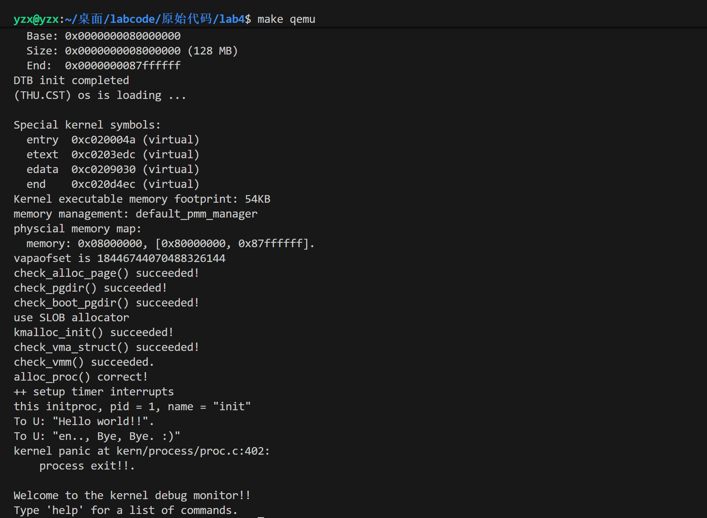
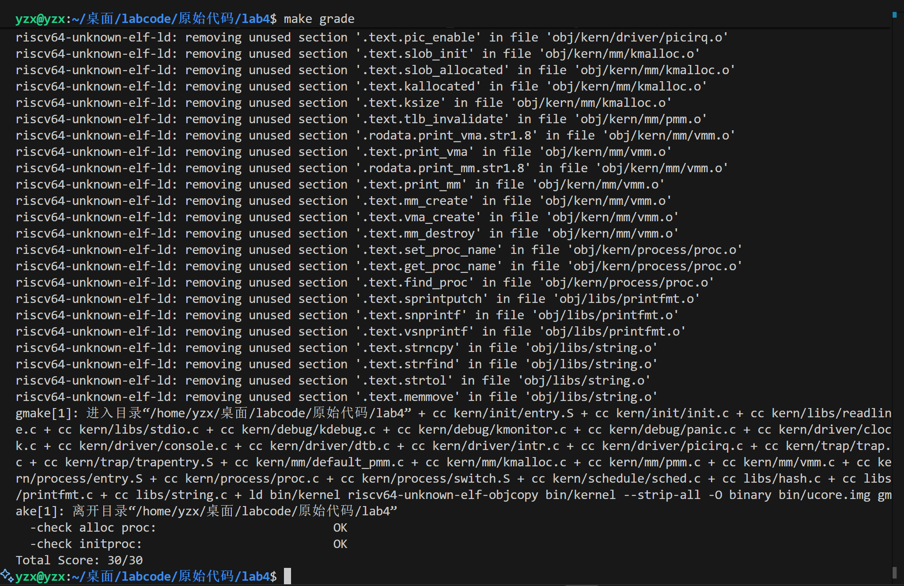

<h1 align='center'>操作系统实验报告

<h2 align='center'>Lab4:进程管理

<h4 align='center'>信息安全	2313781	李胜林	2312796	张肇秋	2312323	杨中秀
</h4>

## 一、实验目的

1. 了解虚拟内存管理的基本结构，掌握虚拟内存的组织与管理方式
2. 了解内核线程创建/执行的管理过程
3. 了解内核线程的切换和基本调度过程

## 二、实验内容

​	本次实验将在实验二和实验三的基础上进行，主要是完成以下两方面的内容：其一是**进一步完善虚拟内存管理，实现基本的地址空间结构**。通过引入虚拟内存描述结构，管理进程或线程的虚拟地址空间布局，为每个执行实体提供逻辑上的运行空间。其二是**引入内核线程机制，实现多执行流并发运行能力**。实现线程控制块、上下文切换和调度器等内容，从而实现多线程并发执行，使内核能够调度多个执行实体轮流使用 CPU 运行。

## 三、练习

### （一）练习0：填写已有实验

​	本实验依赖实验2/3。请把你做的实验2/3的代码填入本实验中代码中有“LAB2”,“LAB3”的注释相应部分。

### （二）练习1：分配并初始化一个进程控制块（需要编码）

​	`alloc_proc`函数（位于`kern/process/proc.c`中）负责分配并返回一个新的`struct proc_struct`结构，用于存储新建立的内核线程的管理信息。`ucore`需要对这个结构进行最基本的初始化，你需要完成这个初始化过程。

​	请在实验报告中简要说明你的设计实现过程。并说明`proc_struct`中`struct context context`和`struct trapframe *tf`成员变量含义和在本实验中的作用是什么？

### （三）练习2：分配并初始化一个进程控制块（需要编码）

​	完成在`kern/process/proc.c`中的`do_fork`函数中的处理过程。它的大致执行步骤包括：

1. 调用`alloc_proc`，首先获得一块用户信息块。
2. 为进程分配一个内核栈。
3. 复制原进程的内存管理信息到新进程
4. 复制原进程上下文到新进程
5. 将新进程添加到进程列表
6. 唤醒新进程
7. 返回新进程号

​	请在实验报告中简要说明你的设计实现过程，并回答`ucore`是否做到给每个新`fork`的线程一个唯一的`id`

### （四）练习3：编写`proc_run` 函数（需要编码）

​	`proc_run`用于将指定的进程切换到CPU上运行。它的大致执行步骤包括：

1. 检查要切换的进程是否与当前正在运行的进程相同，如果相同则不需要切换。
2. 禁用中断。使用宏`local_intr_save(x)`和`local_intr_restore(x)`来实现关、开中断。
3. 切换当前进程为要运行的进程。
4. 切换页表，以便使用新进程的地址空间。使用`lsatp(unsigned int pgdir)`函数，可实现修改SATP寄存器值的功能。
5. 实现上下文切换，使用`switch_to()`函数。可实现两个进程的context切换。
6. 允许中断

​	请回答在本实验的执行过程中，创建且运行了几个内核线程？

### （五）扩展练习Challenge

1. 说明语句`local_intr_save(intr_flag);....local_intr_restore(intr_flag);`是如何实现开关中断的？

2. 深入理解不同分页模式的工作原理（思考题）

   get_pte()函数（位于`kern/mm/pmm.c`）用于在页表中查找或创建页表项，从而实现对指定线性地址对应的物理页的访问和映射操作。这在操作系统中的分页机制下，是实现虚拟内存与物理内存之间映射关系非常重要的内容。

   - `get_pte()`函数中有两段形式类似的代码， 结合`sv32`，`sv39`，`sv48`的异同，解释这两段代码为什么如此相像。
   - 目前`get_pte()`函数将页表项的查找和页表项的分配合并在一个函数里，你认为这种写法好吗？有没有必要把两个功能拆开？

## 四、练习解答

### （一）练习0：填写已有实验

​	我们只需要在文件`lab4/kern/trap/trap.c`中补充我们先前的时间中断的代码即可，如下所示：

```c++
#include <sbi.h>

static size_t num = 0;

/*LAB3 请补充你在lab3中的代码 */
clock_set_next_event();
ticks++;
if(ticks%TICK_NUM==0){
    print_ticks();
    num++;
    if(num>=10){
        sbi_shutdown();
    }
} 
```

### (二)练习1：分配并初始化一个进程控制块

#### 编码

​	在这个练习中，我们需要实现的是`alloc_proc`函数，这个函数主要是实现分配并初始化进程控制块(`proc_struct`)功能。它的核心功能是从内核堆中分配一块内存用于存储**进程控制块**（`struct proc_struct`），并对 PCB 中的所有字段进行默认**初始化**，返回一个 “未就绪但结构完整” 的**进程控制块指针**。

​	而我们可以对应的头文件中找到该进程控制块的声明：

```c++
struct proc_struct
{
    enum proc_state state;        // Process state
    int pid;                      // Process ID
    int runs;                     // the running times of Proces
    uintptr_t kstack;             // Process kernel stack
    volatile bool need_resched;   // bool value: need to be rescheduled to release CPU?
    struct proc_struct *parent;   // the parent process
    struct mm_struct *mm;         // Process's memory management field
    struct context context;       // Switch here to run process
    struct trapframe *tf;         // Trap frame for current interrupt
    uintptr_t pgdir;              // the base addr of Page Directroy Table(PDT)
    uint32_t flags;               // Process flag
    char name[PROC_NAME_LEN + 1]; // Process name
    list_entry_t list_link;       // Process link list
    list_entry_t hash_link;       // Process hash list
};
```

​	这里面有几个重要的成员变量：

+ `mm`：这里面保存了内存管理的信息，包括内存映射，虚存管理等内容。我的理解是这个结构体应该是用于进程内存的管理。
+ `parent`：里面保存了进程的父进程的指针。我们在实验指导书知道，除了`idle`进程没有父进程，其余进程都存在父进程。这样有利于维护父进程对子进程的一些特殊操作。
+ `context`:`context`中保存了进程执行的上下文，也就是几个关键的寄存器的值。这些寄存器的值用于在进程切换中还原之前进程的运行状态.
+ `tf`：`tf`里保存了进程的中断帧。当进程从用户空间跳进内核空间的时候，进程的执行状态被保存在了中断帧中。
+ `pgdir`：即页目录（Page Directory）的基址。在 RISC-V 架构中，CPU 通过 `satp` 寄存器找到当前页表的根节点，从而进行地址翻译。`pgdir` 字段保存的就是每个进程的页表根节点的物理地址。当进行进程切换时，内核需要将下一个要运行进程的 `pgdir` 值加载到 `satp` 寄存器中，这样才能正确地切换到新的地址空间。
+ `kstack`: 每个线程都有一个内核栈，并且位于内核地址空间的不同位置。对于内核线程，该栈就是运行时的程序使用的栈；而对于普通进程，该栈是发生特权级改变的时候使保存被打断的硬件信息用的栈。kstack记录了分配给该进程/线程的内核栈的位置。

我们主要通过下面这样来实现：

```c++
static struct proc_struct *
alloc_proc(void)
{
    struct proc_struct *proc = kmalloc(sizeof(struct proc_struct));
    if (proc != NULL)
    {
        // LAB4:EXERCISE1 2312323
        proc->state = PROC_UNINIT;
        proc->pid = -1;
        proc->pgdir = boot_pgdir_pa;     
        proc->runs = 0;
        proc->kstack = 0;
        proc->need_resched = 0;
        proc->parent = NULL;
        proc->mm = NULL;
        memset(&(proc->context), 0, sizeof(struct context));
        proc->tf = NULL;
        proc->flags = 0;
        memset(proc->name, 0, PROC_NAME_LEN + 1);
    }
    return proc;
}
```

​	对于该结构体中的每个成员变量，我们初始化为默认的状态，包括

+ 初始化进程状态为未初始化:` proc->state = PROC_UNINIT;`
+ 初始化进程ID为-1:`proc->pid = -1;`
+ 使用内核页目录表的基址:`proc->pgdir = boot_pgdir_pa;`
+ 初始化运行次数为0:`proc->runs = 0;`
+ 初始化内核栈地址为0:`proc->kstack = 0;`
+ 初始化不需要重新调度:`proc->need_resched = 0;`
+ 初始化父进程指针为NULL:`proc->parent = NULL;`
+ 初始化内存管理结构为NULL:`proc->mm = NULL;`
+ 初始化上下文结构，且全部设为0:`memset(&(proc->context), 0, sizeof(struct context));`
+ 初始化陷阱帧（`tf`）指针为NULL:`proc->tf = NULL;`
+ 初始化进程标志为0:`proc->flags = 0;`
+ 初始化进程名称为空字符串:`memset(proc->name, 0, PROC_NAME_LEN + 1);`

#### 问题

​	请说明proc_struct中`struct context context`和`struct trapframe *tf`成员变量含义和在本实验中的作用是啥？

**struct context context**

​	含义：存储进程在内核态运行时的关键寄存器状态，是进程切换（`switch_to`）的核心数据 。

​	作用：1.保存与恢复内核态执行现场

​		    2.初始化内核线程 / 子进程的执行起点

​		    3.最小化切换开销

**struct trapframe *tf**

​	含义：指向一块内存区域，存储进程在触发中断、异常或系统调用时的完整寄存器状态（包括用户态和内核态的所有通用寄存器、状		    态寄存器 `sstatus`、程序计数器 `epc` 等）

​	作用：1.保存中断 / 异常发生时的全量状态

​		    2.传递内核线程 / 子进程的启动参数与执行入口

​		    3.衔接用户态与内核态

### （三）练习2：分配并初始化一个进程控制块（需要编码）

#### 编码

​	`do_fork()` 是`ucore`操作系统内核中进程/线程创建的核心函数，其核心功能是：以当前进程（父进程）为模板，创建一个新的子进程/线程，复制父进程的资源，并将子进程设为就绪态，最终返回子进程的`PID`或`0`。

​	我们主要的实现方式如下所示：

​	第一步，调用alloc_proc，首先获得一块用户信息块。

```c++
if ((proc = alloc_proc()) == NULL) {
    goto fork_out;
}
```

​	第二步，为进程分配一个内核栈。

```c++
if (setup_kstack(proc) != 0) {
    goto bad_fork_cleanup_proc;
}
```

​	第三步，复制原进程的内存管理信息到新进程

```c++
if (copy_mm(clone_flags, proc) != 0) {
    goto bad_fork_cleanup_kstack;
}
```

​	第四步，复制原进程上下文到新进程

```c++
copy_thread(proc, stack, tf);
```

​	第五步，将新进程添加到进程列表

```c++
bool intr_flag;
local_intr_save(intr_flag);  // 关中断，保护临界区
proc->pid = get_pid();
proc->parent = current;
hash_proc(proc);
list_add(&proc_list, &(proc->list_link));
nr_process++;
local_intr_restore(intr_flag);
```

​	第六步，唤醒新进程

```c++
wakeup_proc(proc);
```

​	第七步，返回新进程号

```c++
ret = proc->pid;
```

​	这七步是 `do_fork() `创建子进程的核心流程，通过这七步我们可以实现从资源分配到激活就绪完成子进程全生命周期初始化。即先通过 `alloc_proc `分配并初始化 `PCB`，再用 `setup_kstack `分配独立内核栈，依据 `clone_flags` 经 `copy_mm `复制或共享内存空间，通过 `copy_thread` 配置陷阱帧与内核上下文；随后关中断保护临界区，为子进程分配` PID`、绑定父进程并注册到内核进程链表与哈希表，更新进程总数后开中断；最后通过` wakeup_proc `设子进程为就绪态，父进程返回子进程 `PID`，全程保障资源无泄漏、并发安全，实现进程/线程统一创建。

#### 问题

​	请说明ucore是否做到给每个新fork的线程一个唯一的id？请说明你的分析和理由

​	`ucore` 做到了给每个新 `fork` 的线程分配唯一 `ID（PID）`。分析与理由如下：通过 `do_fork()` 第 5 步的 `get_pid()` 函数，系统会从 1 到 `MAX_PID` 范围内分配未被占用的 `PID`，分配时遍历 `proc_list` 检查` PID `唯一性，若当前 `PID` 已被使用则递增重试，直至找到空闲 `PID`；且 `nr_process` 限制进程总数不超过 `MAX_PID`，结合 `MAX_PID > MAX_PROCESS` 的断言，确保不会出现 `PID `耗尽导致的重复问题，同时新线程的` PID` 会存入 `PCB` 并注册到哈希表，进一步保障后续查找与管理中 `PID` 的唯一性。

### （四）练习3：编写`proc_run` 函数（需要编码）

#### 编码

​	`proc_run` 是 `ucore` 内核的进程切换核心函数，作用是将指定进程 `proc` 调度到 `CPU` 上执行。其执行步骤主要为：先判断目标进程是否为当前运行进程，若不是则先通过 `local_intr_save` 禁用中断保障并发安全；随后保存当前进程 `prev`、指定目标进程 `next`，更新全局当前进程指针 `current` 为目标进程；再根据目标进程 `pgdir` 状态切换页表（若为用户进程，则加载自身页表。若为内核线程，则使用内核页表 `boot_pgdir_pa`），确保地址空间正确。接着通过 `switch_to` 完成 `prev` 与 `next` 的内核态上下文切换，最后用 `local_intr_restore` 恢复中断，实现进程的无缝切换与执行权移交。

```c++
void proc_run(struct proc_struct *proc)
{
    if (proc != current)
    {
        // LAB4:EXERCISE3 2312323
        /*
         * Some Useful MACROs, Functions and DEFINEs, you can use them in below implementation.
         * MACROs or Functions:
         *   local_intr_save():        Disable interrupts
         *   local_intr_restore():     Enable Interrupts
         *   lsatp():                   Modify the value of satp register
         *   switch_to():              Context switching between two processes
         */
        bool intr_flag;
        struct proc_struct *prev = current;  // 保存当前进程
        struct proc_struct *next = proc;     // 设置要切换到的进程
        // 禁用中断
        local_intr_save(intr_flag);
        // 切换当前进程为要运行的进程
        current = proc;
        // 切换页表，使用新进程的地址空间
        // 注意：对于内核线程，pgdir可能为NULL，使用boot_pgdir_pa
        if (proc->pgdir != 0) {
            lsatp(proc->pgdir);  // 加载新进程的页表到 satp 寄存器
        } else {
            lsatp(boot_pgdir_pa);  // 使用内核页表
        }
        // 实现上下文切换
        switch_to(&(prev->context), &(next->context));
        // 允许中断
        local_intr_restore(intr_flag);
    }
}
```

#### 问题

​	在本实验的执行过程中，创建且运行了几个内核线程？

​	创建了**两个**内核线程，分别是**`idleproc`**（idle 线程）和**`initproc` **（init 线程）。

### （五）扩展练习Challenge


## 五、运行结果

​	在编写完练习的代码后，我们使用`make qemu`尝试运行，我们可以看到下面的结果：



​	然后我们使用`make grade`来测试得分，结果如下所示：

​	

​	我们可以看到我们的得分为30/30，说明我们这次实验已经成功完成了。

## 六、知识点总结

