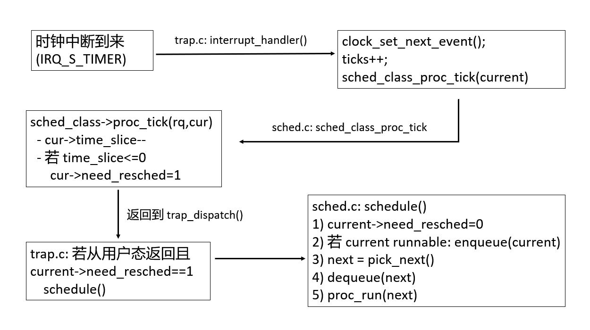

<h1 align='center'>操作系统实验报告
</h1>

<h2 align='center'>Lab6:进程调度

<h4 align='center'>信息安全 	2313781 李胜林		2312796 张肇秋		2312323 杨中秀

## 一、实验目的

1. 理解操作系统的调度管理机制
2. 熟悉 `ucore` 的系统调度器框架，实现缺省的`Round-Robin` 调度算法
3. 基于调度器框架实现一个(`Stride Scheduling`)调度算法来替换缺省的调度算法

## 二、实验内容

​	在前两章中，我们已经分别实现了内核进程和用户进程，并且让他们正确运行了起来。同时我们也实现了一个简单的调度算法，`FIFO`调度算法，来对我们的进程进行调度,可通过阅读实验五下的 `kern/schedule/sched.c` 的 `schedule` 函数的实现来了解其`FIFO`调度策略。但是，单单如此就够了吗？显然，我们可以让`ucore`支持更加丰富的调度算法，从而满足各方面的调度需求。与实验五相比，实验六专门需要针对处理器调度框架和各种算法进行设计与实现，为此对`ucore`的调度部分进行了适当的修改，使得`kern/schedule/sched.c `只实现调度器框架，而不再涉及具体的调度算法实现。而调度算法在单独的文件（`default_sched.[c|h]`）中实现。

​	在本次实验中，`init/init.c`中加入了对`sched_init`函数的调用。这个函数主要完成调度器和特定调度算法的绑定。初始化后，我们在调度函数中就可以使用相应的接口，切换我们实现的不同的调度算法了。这也是在C语言环境下对于面向对象编程模式的一种模仿。这样之后，我们只需要关注于实现调度类的接口即可，操作系统也同样不关心调度类具体的实现，方便了新调度算法的开发。本次实验，主要是熟悉`ucore`的系统调度器框架，以及基于此框架实现`Round-Robin（RR）` 调度算法。然后进一步完成`Stride`调度算法。

## 三、练习

### 练习0：填写已有实验

​	本实验依赖实验2/3/4/5。请把实验2/3/4/5的代码填入本实验中代码中有“LAB2”/“LAB3”/“LAB4”“LAB5”的注释相应部分。并确保编译通过。 注意：为了能够正确执行lab6的测试应用程序，可能需对已完成的实验2/3/4/5的代码进行进一步改进。 由于我们在进程控制块中记录了一些和调度有关的信息，例如`Stride`、优先级、时间片等等，因此我们需要对进程控制块的初始化进行更新，将调度有关的信息初始化。同时，由于时间片轮转的调度算法依赖于时钟中断，因此也要对时钟中断的处理进行一定的更新。

### 练习1：理解调度器框架的实现

​	请仔细阅读和分析调度器框架的相关代码，特别是以下两个关键部分的实现：

​	在完成练习0后，请仔细阅读并分析以下调度器框架的实现：

+ 调度类结构体 `sched_class` 的分析：请详细解释 `sched_class` 结构体中每个函数指针的作用和调用时机，分析为什么需要将这些函数定义为函数指针，而不是直接实现函数。
+ 运行队列结构体 `run_queue` 的分析：比较lab5和lab6中 `run_queue` 结构体的差异，解释为什么`lab6`的 `run_queue` 需要支持两种数据结构（链表和斜堆）
+ 调度器框架函数分析：分析 `sched_init()`、`wakeup_proc() `和` schedule() `函数在lab6中的实现变化，理解这些函数如何与具体的调度算法解耦

​	对于调度器框架的使用流程，请在实验报告中完成以下分析：

+ 调度类的初始化流程：描述从内核启动到调度器初始化完成的完整流程，分析 `default_sched_class` 如何与调度器框架关联。
+ 进程调度流程：绘制一个完整的进程调度流程图，包括：时钟中断触发、`proc_tick` 被调用、`schedule()` 函数执行、调度类各个函数的调用顺序。并解释 `need_resched` 标志位在调度过程中的作用
+ 调度算法的切换机制：分析如果要添加一个新的调度算法（如`stride`），需要修改哪些代码？并解释为什么当前的设计使得切换调度算法变得容易。

### 练习2: 实现 Round Robin 调度算法

​	需要完成 `kern/schedule/default_sched.c` 文件中的 `RR_init`、`RR_enqueue`、`RR_dequeue`、`RR_pick_next `和 `RR_proc_tick` 函数的实现，使系统能够正确地进行进程调度。代码中所有需要完成的地方都有“`LAB6`”和“`YOUR CODE`”的注释，请在提交时特别注意保持注释，将“`YOUR CODE`”替换为自己的学号，并且将所有标有对应注释的部分填上正确的代码。

​	请在实验报告中完成：

+ 比较一个在`lab5`和`lab6`都有, 但是实现不同的函数, 说说为什么要做这个改动, 不做这个改动会出什么问题
+ 描述你实现每个函数的具体思路和方法，解释为什么选择特定的链表操作方法。对每个实现函数的关键代码进行解释说明，并解释如何处理**边界情况**。
+ 展示 `make grade` 的**输出结果**，并描述在 `QEMU` 中观察到的调度现象。
+ 分析 `Round Robin` 调度算法的优缺点，讨论如何调整时间片大小来优化系统性能，并解释为什么需要在 `RR_proc_tick` 中设置 `need_resched` 标志。
+ **拓展思考**：如果要实现优先级 `RR` 调度，你的代码需要如何修改？当前的实现是否支持多核调度？如果不支持，需要如何改进？

### 扩展练习 Challenge 1: 实现 Stride Scheduling 调度算法

​	首先需要换掉RR调度器的实现，在sched_init中切换调度方法。然后根据此文件和后续文档对Stride度器的相关描述，完成Stride调度算法的实现。 简要说明如何设计实现”多级反馈队列调度算法“，给出概要设计，鼓励给出详细设计。简要证明/说明（不必特别严谨，但应当能够”说服你自己“），为什么Stride算法中，经过足够多的时间片之后，每个进程分配到的时间片数目和优先级成正比。

### 扩展练习 Challenge 2 ：在ucore上实现尽可能多的各种基本调度算法(FIFO, SJF,...)，并设计各种测试用例，能够定量地分析出各种调度算法在各种指标上的差异，说明调度算法的适用范围。


## 四、练习解答

### 练习0：填写已有实验

#### Lab2：

​	练习2的代码不需要补充，框架中已经完成补充了。

#### Lab3：

​	有关时钟中断的代码，我们需要进行下面的修改：

```C++
case IRQ_S_TIMER:   
    // lab6: 2312323  (update LAB3 steps)
    //在时钟中断时调用调度器的 sched_class_proc_tick 函数
    //调用当前调度类的时钟处理函数
    clock_set_next_event();
    ticks++;
    if (current)
        sched_class_proc_tick(current);
break;
```

​	这里我们的逻辑与前几次有所不同，这里我们没有将`need_resched`变量设置为1，这是因为我们在这里调用的函数`shced_class_proc_tick`中已经将这个变量赋好值了，因此，在这里我们只需要调用`clock_set_next_event()`预设下次中断时间，然后再累加时钟中断计数器`ticks`，接着判断当前进程是否存在，若存在则调用`sched_class_proc_tick()`就可以了。

```C++
void sched_class_proc_tick(struct proc_struct *proc)
{
    if (proc != idleproc)
    {
        sched_class->proc_tick(rq, proc);
    }
    else
    {
        proc->need_resched = 1;
    }
}
```

#### Lab4

##### `alloc_proc`

```C++
static struct proc_struct *
alloc_proc(void)
{
    struct proc_struct *proc = kmalloc(sizeof(struct proc_struct));
    if (proc != NULL)
    {
        // 初始化进程状态为未初始化
        proc->state = PROC_UNINIT;
        // 初始化进程ID为-1（无效ID）
        proc->pid = -1;
        // 使用内核页目录表的基址
        proc->pgdir = 0;//turned into uninit status     
        // 初始化运行次数为0
        proc->runs = 0;
        // 初始化内核栈地址为0
        proc->kstack = 0;
        // 初始化不需要重新调度
        proc->need_resched = 0;
        // 初始化父进程指针为NULL
        proc->parent = NULL;
        // 初始化内存管理结构为NULL
        proc->mm = NULL;
        // 初始化上下文结构（全部设为0）
        memset(&(proc->context), 0, sizeof(struct context));
        // 初始化陷阱帧指针为NULL
        proc->tf = NULL;
        // 初始化进程标志为0
        proc->flags = 0;
        // 初始化进程名称为空字符串
        memset(proc->name, 0, PROC_NAME_LEN + 1);
        // 初始化等待状态为0
        proc->wait_state = 0;
        // 初始化进程关系指针为NULL
        proc->cptr = NULL;
        proc->optr = NULL;
        proc->yptr = NULL;
        // LAB6:2312323 (update LAB5 steps)
        // 初始化运行队列指针为NULL
        proc->rq = NULL;
        // 初始化运行链接列表项
        list_init(&proc->run_link);
        // 初始化时间片为0
        proc->time_slice = 0;
        // 初始化lab6运行池条目
        skew_heap_init(&(proc->lab6_run_pool));
        // 初始化lab6步幅为0
        proc->lab6_stride = 0;
        // 初始化lab6优先级为0
        proc->lab6_priority = 0;
    }
}
```

​	在进程初始化分配这一部分，我们是根据实验中`PCB`新增的成员变量，完成的初始化。主要是针对这几部分:

```C++
struct run_queue *rq;                       // run queue contains Process
list_entry_t run_link;                      // the entry linked in run queue
int time_slice;                             // time slice for occupying the CPU
skew_heap_entry_t lab6_run_pool;            // entry in the run pool (lab6 stride)
uint32_t lab6_priority;
```

##### `proc_run`

​	这部分的代码没有进行修改，我们仍然填写的是实验四中的代码，便不再说明，如下所示：

```C++
void proc_run(struct proc_struct *proc)
{
    if (proc != current)
    {
        bool intr_flag;
        struct proc_struct *prev = current;  
        struct proc_struct *next = proc;     
        local_intr_save(intr_flag);
        current = proc;
        if (proc->pgdir != 0) {
            lsatp(proc->pgdir);  
        } else {
            lsatp(boot_pgdir_pa);  
        }
        switch_to(&(prev->context), &(next->context));
        local_intr_restore(intr_flag);
    }
}
```

##### `dofork`

​	这部分同样也没有修改，我们只需使用实验五中的代码就可以了

```C++
int do_fork(uint32_t clone_flags, uintptr_t stack, struct trapframe *tf)
{
    int ret = -E_NO_FREE_PROC;
    struct proc_struct *proc;
    if (nr_process >= MAX_PROCESS)
    {
        goto fork_out;
    }
    ret = -E_NO_MEM;
    if ((proc = alloc_proc()) == NULL) {
        goto fork_out;
    }
    proc->parent=current;
    assert(current->wait_state==0);
    if (setup_kstack(proc) != 0) {
        goto bad_fork_cleanup_proc;
    }
    if (copy_mm(clone_flags, proc) != 0) {
        goto bad_fork_cleanup_kstack;
    }
    copy_thread(proc, stack, tf);
    bool intr_flag;
    local_intr_save(intr_flag);  
    proc->pid = get_pid();
    hash_proc(proc);
    set_links(proc);
    local_intr_restore(intr_flag);
    wakeup_proc(proc);
    ret = proc->pid;
fork_out:
    return ret;
bad_fork_cleanup_kstack:
    put_kstack(proc);
bad_fork_cleanup_proc:
    kfree(proc);
    goto fork_out;
}
```

#### Lab5

##### `copy_range`

​	在这部分函数中，我们仍然使用实验五中的代码，但我们只使用非`COW`分支的部分，如下所示：

```C++
int copy_range(pde_t *to, pde_t *from, uintptr_t start, uintptr_t end,bool share)
{
    assert(start % PGSIZE == 0 && end % PGSIZE == 0);
    assert(USER_ACCESS(start, end));
    do
    {
        pte_t *ptep = get_pte(from, start, 0), *nptep;
        if (ptep == NULL)
        {
            start = ROUNDDOWN(start + PTSIZE, PTSIZE);
            continue;
        }
        if (*ptep & PTE_V)
        {
            if ((nptep = get_pte(to, start, 1)) == NULL)
            {
                return -E_NO_MEM;
            }
            uint32_t perm = (*ptep & PTE_USER);
            struct Page *page = pte2page(*ptep);
            struct Page *npage = alloc_page();
            assert(page != NULL);
            assert(npage != NULL);
            int ret = 0;
            void *src_kvaddr = page2kva(page);
            void *dst_kvaddr = page2kva(npage);
            memcpy(dst_kvaddr, src_kvaddr, PGSIZE);
            ret = page_insert(to, npage, start, perm);
            assert(ret == 0);
        }
        start += PGSIZE;
    } while (start != 0 && start < end);
    return 0;
}
```

##### `load_icode`

​	这里的代码也没有修改，我们只需要使用Lab5中的内容就可以了，如下所示：

```C++
tf->gpr.sp = USTACKTOP;
tf->epc = elf->e_entry;
sstatus &= ~SSTATUS_SPP;   
sstatus |= SSTATUS_SPIE;   
tf->status = sstatus;
ret = 0;
```

### 练习1：理解调度器框架的实现

#### 调度器框架的实现

##### 调度类结构体 `sched_class`分析

```C++
struct sched_class
{
    const char *name;
    void (*init)(struct run_queue *rq);
    void (*enqueue)(struct run_queue *rq, struct proc_struct *proc);
    void (*dequeue)(struct run_queue *rq, struct proc_struct *proc);
    struct proc_struct *(*pick_next)(struct run_queue *rq);
    void (*proc_tick)(struct run_queue *rq, struct proc_struct *proc);
};
```

​	这部分是我们的调度类的结构体，这里面定义了六个函数指针，他们分别有不同的作用，我们将分别说明对应的作用。

1. `name`:打印当前使用的调度算法名字
2. `(*init)(struct run_queue *rq)`:初始化运行队列 `run_queue` 的内部结构
3. `(*enqueue)(struct run_queue *rq, struct proc_struct *proc)`:把一个可运行进程放入运行队列（就绪队列），并维护队列元数据。
4. `(*dequeue)(struct run_queue *rq, struct proc_struct *proc)`:从运行队列移除一个进程
5. *`(*pick_next)(struct run_queue *rq)`:从运行队列选择“下一个要运行”的进程
6. `(*proc_tick)(struct run_queue *rq, struct proc_struct *proc)`:时钟中断到来时，更新当前进程的时间片/优先级相关状态，并决定是否触发调度。

​	在这次实验中，我们首先使用了两个调度类结构体，分别是`RR`调度算法和`stride`调度算法对应他们对应的调度的处理方式，如下所示:

```C++
//stride调度算法
struct sched_class stride_sched_class = {
    .name = "stride_scheduler",
    .init = stride_init,
    .enqueue = stride_enqueue,
    .dequeue = stride_dequeue,
    .pick_next = stride_pick_next,
    .proc_tick = stride_proc_tick,
};
//RR调度算法
struct sched_class default_sched_class = {
    .name = "RR_scheduler",
    .init = RR_init,
    .enqueue = RR_enqueue,
    .dequeue = RR_dequeue,
    .pick_next = RR_pick_next,
    .proc_tick = RR_proc_tick,
};
```

​	使用函数指针，而非直接使用函数的原因：`schedule()/wakeup_proc()/sched_init()` 这些框架逻辑不知道具体是RR算法还是 Stride算法亦或是其他的算法。如果使用函数的话，每一种算法都要加一个分支逻辑，需要修改外层框架的代码，既不利于代码的可拓展性，也增加了代码的理解复杂度。如果我们使用函数指针的话，可以让所有算法通过一个接口，调用同样的函数，而具体策略通过不同的调度器来实现，这样有利于代码的维护与拓展。

##### 运行队列结构体`run_queue`

​	**Lab6**中的`run_queue`

```C++
struct run_queue
{
    list_entry_t run_list;
    unsigned int proc_num;
    int max_time_slice;
    // For LAB6 ONLY
    skew_heap_entry_t *lab6_run_pool;
};
```

​	**Lab5**中的`run_queue`:

​	在Lab5中，我们搜索并没有找到对应的结构体，它在实验五中可能是别的名字，但根据上面Lab6的`run_queue`中的注释，我们可以意识到，在Lab5中应该一般只有上面这三个属性，而在Lab6中应该还会有一个`skew_heap_entry_t *lab6_run_pool;`属性，这个是斜堆/优先队列的结构。

​	Lab6中需要链表和斜堆两种结构的原因是：Lab6中不止有一种调度算法，现在我们已经实现了RR和Stride调度算法，在之后如果有时间，我们还可能写别的调度算法。针对目前的两个调度算法：

​	如果使用RR算法，则需要使用链表。而如果使用Stride算法，则需要使用斜堆的结构，因为我们每次需要取Stride中最小的进程来进行调度。综上所述，我们在Lab6中使用多种数据结构是实验要求决定的，我们在实验中需要实现多种调度算法，只有一种数据结构的话，针对某些调度算法而言，这种数据结构并非最优的。因此，我们需要使用多种数据结构来实现多种调度算法。

##### 分析sched_init()、wakeup_proc() 和 schedule() 函数在lab6中的实现变化

​	**sched_init**:用 `sched_class` 指针绑定具体算法

```C++
void sched_init(void)
{
    list_init(&timer_list); 
    sched_class = &default_sched_class;
    //sched_class = &stride_sched_class;
    rq = &__rq;
    rq->max_time_slice = MAX_TIME_SLICE;
    sched_class->init(rq);
    cprintf("sched class: %s\n", sched_class->name);
}
```

​	**wakeup_proc**:

​	**Lab5:**

```
void wakeup_proc(struct proc_struct *proc)
{
    assert(proc->state != PROC_ZOMBIE);
    bool intr_flag;
    local_intr_save(intr_flag);
    {
        if (proc->state != PROC_RUNNABLE)
        {
            proc->state = PROC_RUNNABLE;
            proc->wait_state = 0;
        }
        else
        {
            warn("wakeup runnable process.\n");
        }
    }
    local_intr_restore(intr_flag);
}

```

​	**Lab6:**

```C++
void wakeup_proc(struct proc_struct *proc)
{
    assert(proc->state != PROC_ZOMBIE);
    bool intr_flag;
    local_intr_save(intr_flag);
    {
        if (proc->state != PROC_RUNNABLE)
        {
            proc->state = PROC_RUNNABLE;
            proc->wait_state = 0;
            if (proc != current)
            {
                sched_class_enqueue(proc);
            }
        }
        else
        {
            warn("wakeup runnable process.\n");
        }
    }
    local_intr_restore(intr_flag);
}
```

​	Lab6中多了一行`sched_class_enqueue(proc);`即处理进程调度的逻辑，如果要唤醒的该进程与当前进程不符，则将把这个进程放到运行队列中。

​	**schedule()**

​	**Lab5：**

```
void schedule(void)
{
    bool intr_flag;
    list_entry_t *le, *last;
    struct proc_struct *next = NULL;
    local_intr_save(intr_flag);
    {
        current->need_resched = 0;
        last = (current == idleproc) ? &proc_list : &(current->list_link);
        le = last;
        do
        {
            if ((le = list_next(le)) != &proc_list)
            {
                next = le2proc(le, list_link);
                if (next->state == PROC_RUNNABLE)
                {
                    break;
                }
            }
        } while (le != last);
        if (next == NULL || next->state != PROC_RUNNABLE)
        {
            next = idleproc;
        }
        next->runs++;
        if (next != current)
        {
            proc_run(next);
        }
    }
    local_intr_restore(intr_flag);
}
```

​	**Lab6：**

```C++
void schedule(void)
{
    bool intr_flag;
    struct proc_struct *next;
    local_intr_save(intr_flag);
    {
        current->need_resched = 0;
        if (current->state == PROC_RUNNABLE)
        {
            sched_class_enqueue(current);
        }
        if ((next = sched_class_pick_next()) != NULL)
        {
            sched_class_dequeue(next);
        }
        if (next == NULL)
        {
            next = idleproc;
        }
        next->runs++;
        if (next != current)
        {
            proc_run(next);
        }
    }
    local_intr_restore(intr_flag);
}
```

​	在Lab6中，我们直接调用调度类结构体中的对应的函数指针就行了，不需要与lab5中一样，需要进行具体的处理了。这样，决定选哪个进程完全是 `pick_next`需要处理的 ，框架代码不用改就能切换算法。

#### 调度器框架的使用流程

##### 内核启动到调度器初始化完成的完整流程

###### 从 `kern_entry` 跳到 `kern_init`

​	系统启动后，CPU 从启动入口 `kern_entry` 进入内核。在这一阶段，内核主要完成从裸机环境到“可运行 C 代码环境”的过渡。具体包括：保存启动参数，建立并启用早期内核页表，将 CPU 切换到内核虚拟地址空间，随后切换到内核栈，并跳转到 C 语言入口函数 `kern_init()`。

###### 内核初始化`kern_init`

​	**首先**把未初始化全局变量区清零，避免脏数据影响后续模块：

```C++
extern char edata[], end[];
memset(edata, 0, end - edata);
```

​	**然后**输出调试信息

```C++
cons_init();
cprintf("(THU.CST) os is loading ...\n\n");
print_kerninfo();
```

​	**下一步**完成一系列初始化，包括设备树、物理内存管理、中断控制器、IDT以及虚拟内存管理

```C++
dtb_init(); // init dtb
pmm_init(); // init physical memory management
pic_init(); // init interrupt controller
idt_init(); // init interrupt descriptor table
vmm_init(); // init virtual memory management
```

###### 调度器初始化`sched_init`

​	**首先**调用`sched_init();`进行调度器的初始化。

​	**然后**进入`sched_init()`函数体中，

```C++
void sched_init(void)
{
    list_init(&timer_list); 

    sched_class = &default_sched_class;
    //sched_class = &stride_sched_class;

    rq = &__rq;
    rq->max_time_slice = MAX_TIME_SLICE;
    sched_class->init(rq);

    cprintf("sched class: %s\n", sched_class->name);
}
```

​	调用`list_init(&timer_list);`用于管理调度器的计时器链表

​	**接着**选择对应的调度器，选择不同的调度算法。

​	**下一步**是初始化全局运行队列 `rq`，以及定义RR 的时间片上限（后续会用于校正 `proc->time_slice`）

​	**最后**是调用调度类的 `init`，把`rq` 的内部结构”交给算法自己初始化，完成打印提示当前的调度算法，开始执行后续的调度算法等步骤。

##### 进程调度流程图



##### 如果要添加一个新的调度算法（如stride），需要修改哪些代码？

​	新增一个实现文件，在里面包含五个函数，`stride_init`、`stride_enqueue`、`stride_dequeue`、`stride_pick_next`、`stride_proc_tick`。然后在写一个调度器类，如下所示：

```C++
struct sched_class stride_sched_class = {
    .name = "stride_scheduler",
    .init = stride_init,
    .enqueue = stride_enqueue,
    .dequeue = stride_dequeue,
    .pick_next = stride_pick_next,
    .proc_tick = stride_proc_tick,
};
```

​	下一步在`sched_init()`函数中，将原来的RR调度算法改成stride算法就可以完成调度算法的切换了。

```C++
//sched_class = &default_sched_class;   // RR
sched_class = &stride_sched_class;  // Stride
```

### 练习2: 实现 Round Robin 调度算法

#### 实现不同的函数

​	我们就举`schedule()`函数的例子了，在**Lab5**中：

```C++
void schedule(void)
{
    bool intr_flag;
    list_entry_t *le, *last;
    struct proc_struct *next = NULL;
    local_intr_save(intr_flag);
    {
        current->need_resched = 0;
        last = (current == idleproc) ? &proc_list : &(current->list_link);
        le = last;
        do
        {
            if ((le = list_next(le)) != &proc_list)
            {
                next = le2proc(le, list_link);
                if (next->state == PROC_RUNNABLE)
                {
                    break;
                }
            }
        } while (le != last);
        if (next == NULL || next->state != PROC_RUNNABLE)
        {
            next = idleproc;
        }
        next->runs++;
        if (next != current)
        {
            proc_run(next);
        }
    }
    local_intr_restore(intr_flag);
}
```

​	这是一个基于简单循环链表的调度器实现。函数首先保存中断状态并关闭中断，确保调度过程的原子性。核心逻辑是通过遍历进程链表来寻找下一个可运行的进程：从当前进程（如果当前是空闲进程则从链表头部）开始，循环遍历链表，寻找第一个状态为 `PROC_RUNNABLE` 的进程作为下一个运行进程。如果遍历完整条链表都没有找到可运行进程，则选择空闲进程（`idleproc`）作为下一个进程。选中的进程运行次数加一，如果与当前进程不同，则调用 `proc_run()` 进行进程切换。

​	而在**Lab6**中：

```C++
void schedule(void)
{
    bool intr_flag;
    struct proc_struct *next;
    local_intr_save(intr_flag);
    {
        current->need_resched = 0;
        if (current->state == PROC_RUNNABLE)
        {
            sched_class_enqueue(current);
        }
        if ((next = sched_class_pick_next()) != NULL)
        {
            sched_class_dequeue(next);
        }
        if (next == NULL)
        {
            next = idleproc;
        }
        next->runs++;
        if (next != current)
        {
            proc_run(next);
        }
    }
    local_intr_restore(intr_flag);
}
```

​	这是一个基于调度类抽象接口的通用调度器实现。同样在原子上下文中执行，先将当前进程的重新调度标志置零。如果当前进程仍处于可运行状态，则通过 `sched_class_enqueue()` 将其重新加入调度队列。然后通过 `sched_class_pick_next()` 从调度策略中选取下一个要运行的进程，并通过 `sched_class_dequeue()` 将其移出队列。如果没有进程可选，则使用空闲进程。最后更新运行次数，并在需要时执行进程切换。

​	这两个程序的不同之处在于：第一个是硬编码的轮询调度，调度逻辑与数据结构紧密耦合，而第二个采用了策略模式，通过调度类接口实现了策略与机制的分离。在实现方式上，第一个直接操作进程链表进行线性搜索，而第二个通过统一的队列操作接口进行调度管理。在扩展性方面，第一个很难扩展，但第二个程序可以支持多种调算法。

#### 实现的具体思路和方法

##### `RR_init`

```C++
static void
RR_init(struct run_queue *rq)
{
    // LAB6: 2312323
    list_init(&(rq->run_list));
    rq->proc_num = 0;
}
```

​	这里RR调度算法的初始化，只需要一个就绪链表就可以了，初始化为空。

##### `RR_enqueue`

```C++
static void
RR_enqueue(struct run_queue *rq, struct proc_struct *proc)
{
    // LAB6: 2312323
    assert(rq != NULL && proc != NULL);
    //确保这个节点当前没挂在任何队列里
    assert(list_empty(&(proc->run_link)));
    //绑定run queue
    proc->rq = rq;
    //重置时间片
    if (proc->time_slice == 0 || proc->time_slice > rq->max_time_slice) {
        proc->time_slice = rq->max_time_slice;
    }
    //proc->need_resched = 0;
    //插入队尾（RR）
    list_add_before(&rq->run_list, &proc->run_link);
    rq->proc_num++;
}
```

​	思路：首先检查运行队列和进程指针的有效性，并确认进程当前不在任何队列中。然后为进程绑定运行队列，并重置时间片：如果进程时间片为0或超过最大限制，就设置为队列的最大时间片值。最后将进程节点插入队列尾部，并增加队列中的进程计数。整个操作确保了进程能够公平地加入轮转调度。

​	边界处理：1.使用`assert`语句防止空指针和重复入队。2.时间片重置逻辑同时处理了进程首次加入和因某些原因时间片异常的情况。3

##### `RR_dequeue`

```C++
static void
RR_dequeue(struct run_queue *rq, struct proc_struct *proc)
{
    // LAB6: 2312323
    assert(rq != NULL && proc != NULL);
    assert(proc->rq == rq);
    //从队列中删除该节点，并把节点置为“未链接”状态
    list_del_init(&(proc->run_link));
    rq->proc_num--;
}
```

​	思路：首先进行安全检查，确保运行队列和进程指针有效，并且进程确实绑定到该队列。然后调用`list_del_init()`函数执行删除操作，这个函数不仅将进程节点从链表中移除，还会将节点的前后指针重置为指向自身，使节点恢复到**未链接**状态。最后减少队列中的进程计数。

​	边界处理：1.通过`assert`断言防止空指针和进程与队列不匹配的错误操作。2.使用`list_del_init()`而非简单的`list_del()`，确保节点被删除后处于可安全重用的初始化状态。

##### `RR_pick_next`

```C++
static struct proc_struct *
RR_pick_next(struct run_queue *rq)
{
    //LAB6: 2312323
    assert(rq != NULL);
    if (list_empty(&(rq->run_list))) {
        return NULL;
    }
    //取队头元素
    list_entry_t *le = list_next(&(rq->run_list));
    if (le != &(rq->run_list)) {
        return le2proc(le, run_link);
    }
    return NULL;
}
```

​	思路：代码首先检查队列是否为空，为空则返回NULL。然后通过`list_next(&(rq->run_list))`获取队列头节点后的第一个实际进程节点。如果获取的节点不是头节点本身，则将其转换为进程结构体指针返回。这种设计确保了每次调度都**选择队列中等待时间最长**的就绪进程，体现了轮转调度的公平性。

​	边界处理：1.通过`assert`保证队列指针有效。2.通过`list_empty()`检查避免对空队列进行操作。3.双重验证机制：在获取第一个节点后，再次检查该节点是不是头节点。

##### `RR_proc_tick`

```C++
static void
RR_proc_tick(struct run_queue *rq, struct proc_struct *proc)
{
    // LAB6: 2312323
    assert(rq != NULL && proc != NULL);
    assert(proc->rq == rq);
    //时间片减一
    if (proc->time_slice > 0) {
        proc->time_slice--;
    }
    //时间片用尽，设置需要调度标志,一般会把当前进程重新enqueue到队尾
    if (proc->time_slice <= 0) {
        proc->need_resched = 1;
    }
}
```

​	思路：首先验证运行队列和进程指针的有效性，并确认进程属于该队列。然后将进程的剩余时间片减1。当时间片耗尽（`time_slice <= 0`）时，设置进程的`need_resched`标志为1，这会触发调度器在适当的时候重新调度，让当前进程让出CPU。

​	边界处理：1。通过`assert`双重验证确保参数有效性和进程与队列的归属关系。2.条件判断`proc->time_slice > 0`才执行减1操作，防止时间片值为0时出现负数。3.使用`<=`判断而非`==`判断时间片耗尽，这处理了时间片初始值可能为0或异常情况的边界条件；

#### 结果与分析

​	这一部分在第五部分进行了详细介绍。

#### RR调度算法的优缺点

##### 优点：

​	首先，它保证了公平性，从长期来看每个可运行进程都能获得相近的CPU时间份额。其次，实现简单，仅需循环链表即可支持，入队、出队和选取队头操作的时间复杂度均为O(1)。最后，适合交互式场景，当时间片设置较小时，系统能够快速响应用户操作。

##### 缺点：

​	它不区分进程优先级或权重，使得计算密集型进程和交互式进程在调度层面被同等对待。时间片大小的选择面临两难——时间片太大会降低交互响应性，太小则增加上下文切换开销、降低系统吞吐量。此外，频繁的进程切换会破坏缓存局部性，对系统性能造成负面影响。

##### 时间片优化策略：

​	面向交互场景可减小时间片以获得更快的轮转响应，面向吞吐量则可增大时间片以减少切换开销。常见折中方案是让时间片略大于一次典型交互任务的CPU突发时间，避免进程刚开始执行就被切换出去。

##### `need_resched`设置的必要性：

​	在`RR_proc_tick`函数中设置`need_resched`标志是实现抢占式`RR`调度的核心机制：当进程时间片用尽时，该标志被置位；随后在中断返回点检查到此标志时，系统将执行`schedule()`进行强制调度。如果没有这个机制，进程会一直运行直到主动让出`CPU`，从而丧失时间片轮转的公平性。

#### 拓展思考：

##### 实现优先级 RR 调度：

​	我感觉让单链表按优先级有序插入就可以实现优先级的RR调度了。然后我认为这个方法有点太简易了，然后就去查阅了相关资料，然后发现可以使用下面的方法：

​	使用多个队列来实现优先级的RR调度，具体来说是，在` run_queue `结构体中添加了按优先级划分的队列数组 `list_entry_t queues[MAX_PRIO]`，其中 `enqueue` 操作根据进程的优先级将其插入对应优先级的队列尾部；`pick_next `操作从最高优先级向低优先级顺序扫描，选取第一个非空队列的队头进程作为下一个执行进程；`dequeue `操作保持不变，依然调用 `list_del_init` 将进程从队列中移除；而 `proc_tick` 在时间片耗尽时设置 `need_resched` 以触发调度，并可选择实现同优先级RR和不同优先级抢占的混合策略。

##### 当前实现是否支持多核调度

​	不支持。如果想要支持多核调度的话，首先需要将数据结构改为每个CPU独立，包括 `per-CPU run_queue` 数组 `rq[NR_CPUS]` 和 `per-CPU current` 指针，确保各核能独立进行调度决策；同步机制需要升级，`enqueue`、`dequeue` 和 `pick_next` 操作不能仅关闭本地中断，而必须使用自旋锁保护共享的队列数据，防止多核并发访问冲突；进程唤醒时需引入负载均衡策略，`wakeup_proc` 需要智能决策将进程放入哪个`CPU`的 `run_queue`，可考虑基于进程的`CPU`亲和性或系统负载情况；最后需要核间通信机制，通过核间中断通知目标`CPU`及时进行重新调度，确保调度决策能快速在多核间生效。

### 扩展练习 Challenge 1: 实现 Stride Scheduling 调度算法

#### 实现思路

##### `stride_init`

```C++
static void
stride_init(struct run_queue *rq)
{
     /* LAB6 CHALLENGE 1: 2312323
      * (1) init the ready process list: rq->run_list
      * (2) init the run pool: rq->lab6_run_pool
      * (3) set number of process: rq->proc_num to 0
      */
     list_init(&(rq->run_list));
     rq->lab6_run_pool = NULL;
     rq->proc_num = 0;
}
```

​	首先通过 `list_init(&(rq->run_list))` 初始化就绪进程链表，为后续进程管理做好准备。然后将 `rq->lab6_run_pool` 设置为 NULL，这个指针预计用于 stride 调度特有的数据结构，以支持高效的 `stride` 值比较和最小进程选取。最后将 `rq->proc_num` 进程计数器置零，确保调度器从空状态开始运行。

##### `stride_enqueue`

```C++
static void
stride_enqueue(struct run_queue *rq, struct proc_struct *proc)
{
     /* LAB6 CHALLENGE 1: 2312323
      * (1) insert the proc into rq correctly
      * NOTICE: you can use skew_heap or list. Important functions
      *         skew_heap_insert: insert a entry into skew_heap
      *         list_add_before: insert  a entry into the last of list
      * (2) recalculate proc->time_slice
      * (3) set proc->rq pointer to rq
      * (4) increase rq->proc_num
      */
     
     assert(rq != NULL && proc != NULL);

     if (proc->lab6_priority == 0) {
          proc->lab6_priority = 1;
     }

     proc->time_slice = rq->max_time_slice;
     proc->rq = rq;

     rq->lab6_run_pool = skew_heap_insert(rq->lab6_run_pool,&(proc->lab6_run_pool),
proc_stride_comp_f);

     rq->proc_num++;
}
```

​	首先进行参数有效性检查，确保运行队列和进程指针非空。关键步骤是处理优先级：如果进程的 `lab6_priority` 为0，则将其设为1。接着为进程设置时间片，使用运行队列的最大时间片值，并绑定进程到该队列。核心操作是通过 `skew_heap_insert` 将进程插入到斜堆`skew heap`中，使用 `proc_stride_comp_f` 比较函数基于` stride `值进行堆排序，这保证了每次能高效取出` stride` 值最小的进程。最后增加队列中的进程计数。

##### `stride_dequeue`

```C++
static void
stride_dequeue(struct run_queue *rq, struct proc_struct *proc)
{
     /* LAB6 CHALLENGE 1: 2312323
      * (1) remove the proc from rq correctly
      * NOTICE: you can use skew_heap or list. Important functions
      *         skew_heap_remove: remove a entry from skew_heap
      *         list_del_init: remove a entry from the  list
      */
     assert(rq != NULL && proc != NULL);
     assert(proc->rq == rq);

     rq->lab6_run_pool = skew_heap_remove(
          rq->lab6_run_pool,
          &(proc->lab6_run_pool),
          proc_stride_comp_f
     );

     rq->proc_num--;
     proc->rq = NULL;
}
```

​	首先通过断言确保运行队列和进程指针有效，并且进程确实属于该队列。核心操作是调用 `skew_heap_remove` 从斜堆中移除指定进程节点，该函数接收斜堆根指针、待移除节点的指针以及 `stride` 比较函数，返回更新后的堆根指针。移除操作保持了斜堆的结构性质，确保后续操作能正确找到 `stride` 值最小的进程。然后减少队列中的进程计数，并将进程的 `rq` 指针置为 `NULL`，解除进程与运行队列的绑定关系。

##### `stride_pick_next`

```C++
static struct proc_struct *
stride_pick_next(struct run_queue *rq)
{
     /* LAB6 CHALLENGE 1: 2312323
      * (1) get a  proc_struct pointer p  with the minimum value of stride
             (1.1) If using skew_heap, we can use le2proc get the p from rq->lab6_run_pol
             (1.2) If using list, we have to search list to find the p with minimum stride value
      * (2) update p;s stride value: p->lab6_stride
      * (3) return p
      */
     if (rq->proc_num == 0 || rq->lab6_run_pool == NULL) {
          return NULL;
     }

     // skew heap 的根就是 stride 最小的进程
     struct proc_struct *p =
          le2proc(rq->lab6_run_pool, lab6_run_pool);

     // stride += BIG_STRIDE / priority
     uint64_t inc = (uint64_t)BIG_STRIDE / p->lab6_priority;
     if (inc == 0) inc = 1;
     p->lab6_stride += (uint32_t)inc;

     return p;
}
```

​	首先检查运行队列是否为空或斜堆根节点是否存在，若为空则返回 `NULL`。核心逻辑是直接从斜堆根节点获取` stride `值最小的进程，这里是说因为斜堆的性质，根节点始终保持最小` stride` 值，通过 `le2proc` 宏将节点指针转换为进程结构体指针。关键步骤是更新选中进程的` stride` 值：计算步进增量 `inc = BIG_STRIDE / priority`，确保优先级越高的进程（`priority` 值越大）获得的增量越小，从而更频繁地被调度。为了防止除零错误和溢出，当` inc` 为0时将其设为1，并将增量累加到进程的 `lab6_stride` 中。最后返回这个进程供调度器执行。

##### `stride_proc_tick`

```C++
static void
stride_proc_tick(struct run_queue *rq, struct proc_struct *proc)
{
     /* LAB6 CHALLENGE 1: YOUR 2312323 */
     assert(proc != NULL);

     if (proc->time_slice > 0) {
          proc->time_slice--;
     }
     if (proc->time_slice <= 0) {
          proc->need_resched = 1;
     }
}
```

​	首先检查进程指针的有效性，然后对进程的剩余时间片进行递减操作（确保不降到负数）。当时间片耗尽（`time_slice <= 0`）时，将进程的 `need_resched` 标志置为 1，从而触发调度器在适当时候重新调度。值得注意的是，这个函数与 RR 调度器的 `proc_tick` 实现几乎相同，这表明 `stride` 调度算法在时间片管理层面仍采用了与轮转调度相似的基础机制，保留了基于时间片的抢占特性。

##### 调度器

```C++
struct sched_class stride_sched_class = {
    .name = "stride_scheduler",
    .init = stride_init,
    .enqueue = stride_enqueue,
    .dequeue = stride_dequeue,
    .pick_next = stride_pick_next,
    .proc_tick = stride_proc_tick,
};
```

#### 证明Stride算法经过足够多的时间片之后，每个进程分配到的时间片数目和优先级成正比

​	`Stride`算法通过为每个进程维护一个`stride`值来实现按优先级比例分配CPU时间：每次进程被调度后，其$$stride$$增加一个与优先级成反比的步长（$$stride += BIG\_STRIDE / priority$$）。由于调度器总是选择`stride`值最小的进程执行，优先级高的进程（$$priority$$值大）步长较小，$$stride$$增长慢，因此更频繁地被选中。优先级低的进程（$$priority$$值小）步长大，`stride`增长快，被选中的频率较低。经过足够长的调度周期后，各进程的`stride`值会趋近相等，此时每个进程被调用的次数比等于它们步长大小的反比，即优先级之比。

### 扩展练习 Challenge 2 ：在ucore上实现尽可能多的各种基本调度算法(FIFO, SJF,...)，并设计各种测试用例

## 五、实验结果

### RR调度算法:

​	**日志输出**：

```apl

OpenSBI v0.4 (Jul  2 2019 11:53:53)
   ____                    _____ ____ _____
  / __ \                  / ____|  _ \_   _|
 | |  | |_ __   ___ _ __ | (___ | |_) || |
 | |  | | '_ \ / _ \ '_ \ \___ \|  _ < | |
 | |__| | |_) |  __/ | | |____) | |_) || |_
  \____/| .__/ \___|_| |_|_____/|____/_____|
        | |
        |_|

Platform Name          : QEMU Virt Machine
Platform HART Features : RV64ACDFIMSU
Platform Max HARTs     : 8
Current Hart           : 0
Firmware Base          : 0x80000000
Firmware Size          : 112 KB
Runtime SBI Version    : 0.1

PMP0: 0x0000000080000000-0x000000008001ffff (A)
PMP1: 0x0000000000000000-0xffffffffffffffff (A,R,W,X)
(THU.CST) os is loading ...

Special kernel symbols:
  entry  0xc020004a (virtual)
  etext  0xc0205910 (virtual)
  edata  0xc02c27e0 (virtual)
  end    0xc02c6cc0 (virtual)
Kernel executable memory footprint: 796KB
DTB Init
HartID: 0
DTB Address: 0x82200000
Physical Memory from DTB:
  Base: 0x0000000080000000
  Size: 0x0000000008000000 (128 MB)
  End:  0x0000000087ffffff
DTB init completed
memory management: default_pmm_manager
physcial memory map:
  memory: 0x08000000, [0x80000000, 0x87ffffff].
vapaofset is 18446744070488326144
check_alloc_page() succeeded!
check_pgdir() succeeded!
check_boot_pgdir() succeeded!
use SLOB allocator
kmalloc_init() succeeded!
check_vma_struct() succeeded!
check_vmm() succeeded.
sched class: RR_scheduler
++ setup timer interrupts
kernel_execve: pid = 2, name = "priority".
set priority to 6
main: fork ok,now need to wait pids.
set priority to 1
set priority to 2
set priority to 3
set priority to 4
set priority to 5
child pid 3, acc 980000, time 2010
child pid 4, acc 960000, time 2010
child pid 5, acc 948000, time 2010
child pid 6, acc 968000, time 2010
child pid 7, acc 984000, time 2010
main: pid 0, acc 980000, time 2010
main: pid 4, acc 960000, time 2010
main: pid 5, acc 948000, time 2010
main: pid 6, acc 968000, time 2010
main: pid 7, acc 984000, time 2010
main: wait pids over
sched result: 1 1 1 1 1
all user-mode processes have quit.
init check memory pass.
kernel panic at kern/process/proc.c:574:
    initproc exit.
```

​	所有5个子进程（pid 3-7）虽然设置了不同的优先级（1-5），但在运行时间（均为2010个时间单位）和完成的计算量（acc值在948000-984000之间）方面都获得了几乎相等的CPU时间片。

​	**`make grade`输出**：


### stride调度算法：

​	**日志输出**：

```apl

OpenSBI v0.4 (Jul  2 2019 11:53:53)
   ____                    _____ ____ _____
  / __ \                  / ____|  _ \_   _|
 | |  | |_ __   ___ _ __ | (___ | |_) || |
 | |  | | '_ \ / _ \ '_ \ \___ \|  _ < | |
 | |__| | |_) |  __/ | | |____) | |_) || |_
  \____/| .__/ \___|_| |_|_____/|____/_____|
        | |
        |_|

Platform Name          : QEMU Virt Machine
Platform HART Features : RV64ACDFIMSU
Platform Max HARTs     : 8
Current Hart           : 0
Firmware Base          : 0x80000000
Firmware Size          : 112 KB
Runtime SBI Version    : 0.1

PMP0: 0x0000000080000000-0x000000008001ffff (A)
PMP1: 0x0000000000000000-0xffffffffffffffff (A,R,W,X)
(THU.CST) os is loading ...

Special kernel symbols:
  entry  0xc020004a (virtual)
  etext  0xc0205910 (virtual)
  edata  0xc02c27e0 (virtual)
  end    0xc02c6cc0 (virtual)
Kernel executable memory footprint: 796KB
DTB Init
HartID: 0
DTB Address: 0x82200000
Physical Memory from DTB:
  Base: 0x0000000080000000
  Size: 0x0000000008000000 (128 MB)
  End:  0x0000000087ffffff
DTB init completed
memory management: default_pmm_manager
physcial memory map:
  memory: 0x08000000, [0x80000000, 0x87ffffff].
vapaofset is 18446744070488326144
check_alloc_page() succeeded!
check_pgdir() succeeded!
check_boot_pgdir() succeeded!
use SLOB allocator
kmalloc_init() succeeded!
check_vma_struct() succeeded!
check_vmm() succeeded.
sched class: RR_scheduler
++ setup timer interrupts
kernel_execve: pid = 2, name = "priority".
set priority to 6
main: fork ok,now need to wait pids.
set priority to 1
set priority to 2
set priority to 3
set priority to 4
set priority to 5
child pid 3, acc 1000000, time 2010
child pid 4, acc 980000, time 2010
child pid 5, acc 996000, time 2010
child pid 6, acc 988000, time 2010
child pid 7, acc 996000, time 2010
main: pid 0, acc 1000000, time 2010
main: pid 4, acc 980000, time 2010
main: pid 5, acc 996000, time 2010
main: pid 6, acc 988000, time 2010
main: pid 7, acc 996000, time 2010
main: wait pids over
sched result: 1 1 1 1 1
all user-mode processes have quit.
init check memory pass.
kernel panic at kern/process/proc.c:574:
    initproc exit.
```

​	虽然所有5个子进程（pid 3-7）仍具有相同的运行时间（均为2010个时间单位），但它们完成的计算量（acc值在980000-1000000之间）显示出明显差异，这直接反映了它们设置的优先级差异（优先级1-5）。特别值得注意的是，优先级最高的进程（pid 3，优先级5）获得了最高的计算量1000000，而优先级最低的进程（pid 4，优先级1）获得了最低的计算量980000，其他进程的计算量按照优先级顺序基本呈现递增趋势。

## 六、知识点总结


