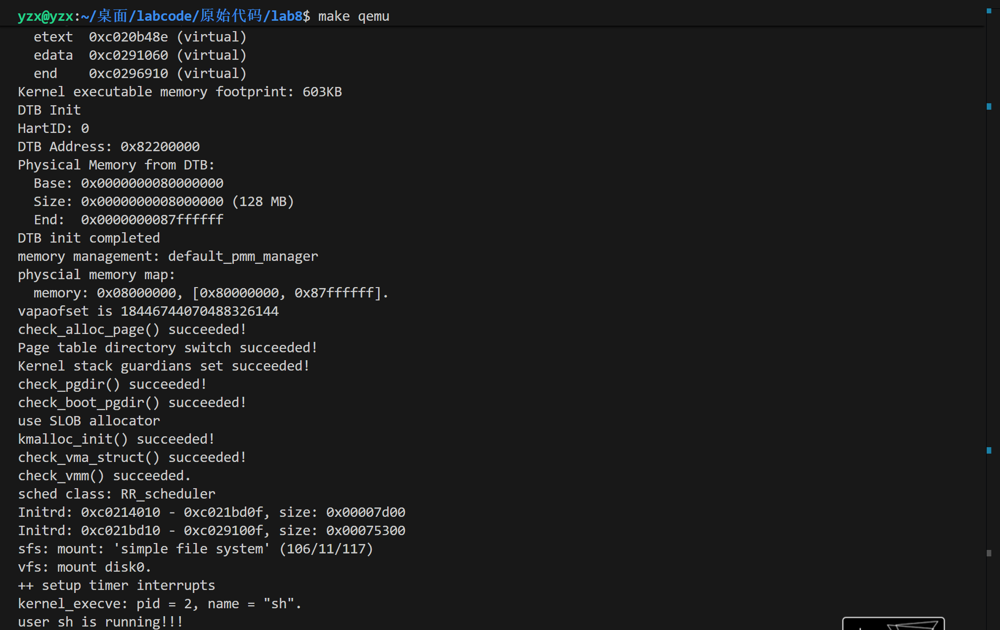
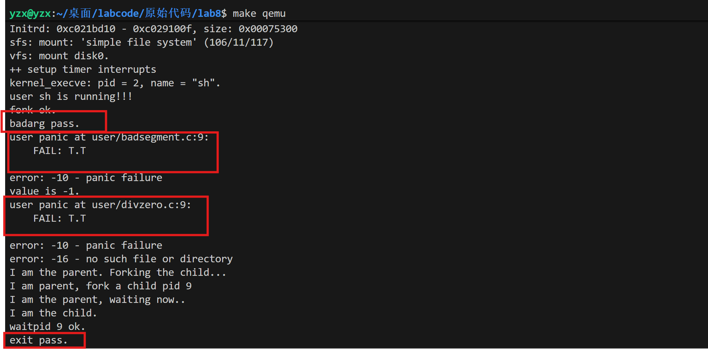
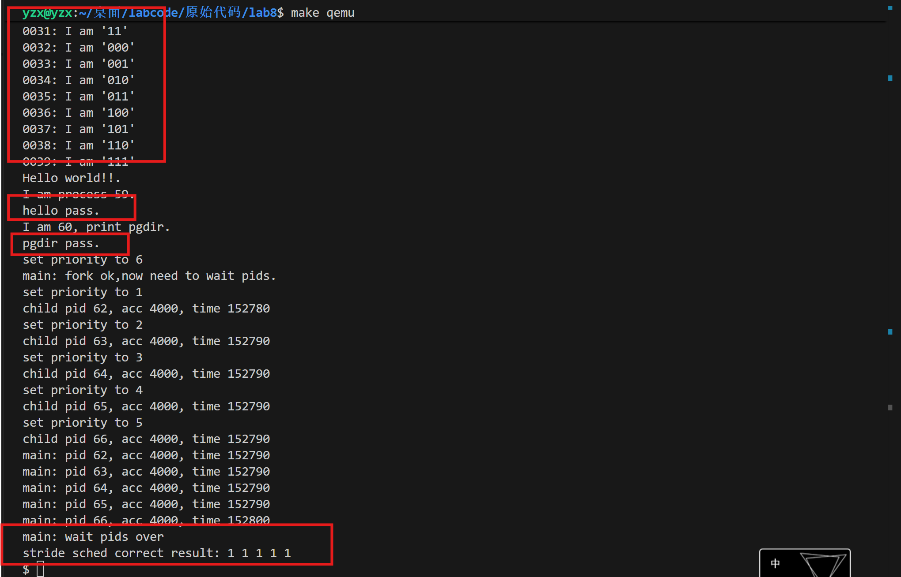
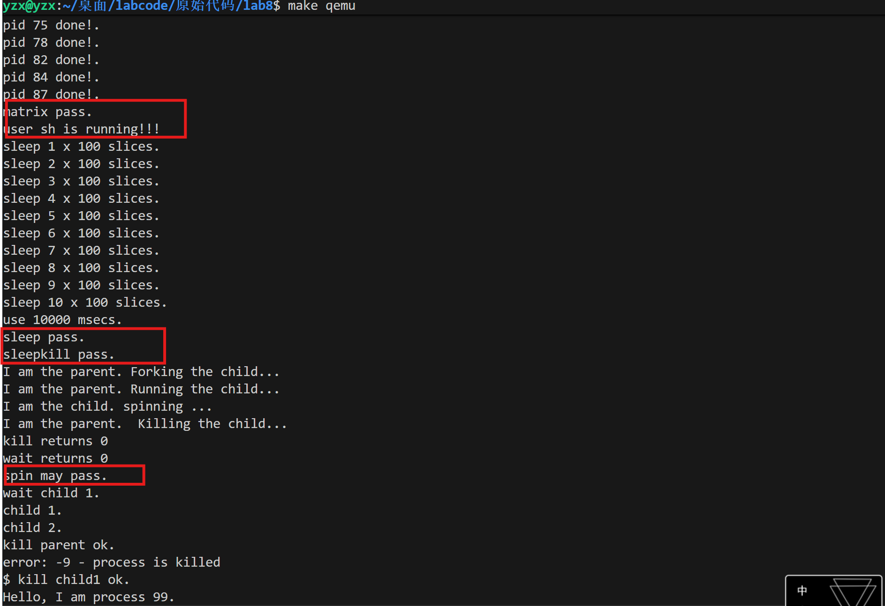
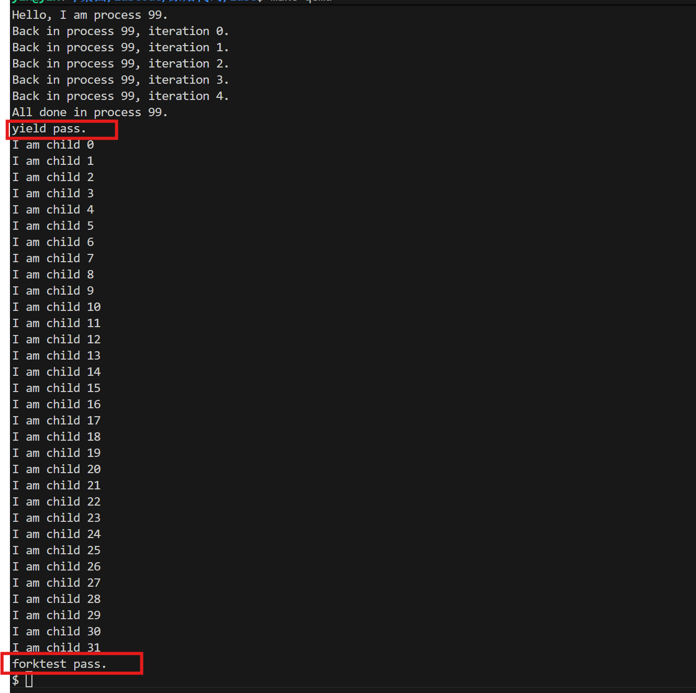

<h1 align='center'>操作系统实验报告
<h2 align='center'>Lab8:文件系统</h2>


<h4 align='center'>信息安全		2313781 李胜林		2312796 张肇秋		2312323 杨中秀

## 一、实验目的

1. 了解文件系统抽象层-VFS的设计与实现

2. 了解基于索引节点组织方式的Simple FS文件系统与操作的设计与实现

3. 了解“一切皆为文件”思想的设备文件设计

4. 了解简单系统终端的实现

## 二、实验内容

​	本次实验涉及的是文件系统，通过分析了解ucore文件系统的总体架构设计，完善读写文件操作(即实现sfs_io_nolock()函数)，从新实现基于文件系统的执行程序机制（即实现load_icode()函数），从而可以完成执行存储在磁盘上的文件和实现文件读写等功能。实验八增加了文件系统，并因此实现了通过文件系统来加载可执行文件到内存中运行的功能，导致对进程管理相关的实现比较大的调整。

## 三、练习

### （一）练习0：填写已有实验

​	本实验依赖实验2/3/4/5/6/7。请把你做的实验2/3/4/5/6/7的代码填入本实验中代码中有“LAB2”/“LAB3”/“LAB4”/“LAB5”/“LAB6” /“LAB7”的注释相应部分。并确保编译通过。注意：为了能够正确执行lab8的测试应用程序，可能需对已完成的实验2/3/4/5/6/7的代码进行进一步改进。

### （二）练习1：完成读文件操作的实现：

​	首先了解打开文件的处理流程，然后参考本实验后续的文件读写操作的过程分析，填写在 `kern/fs/sfs/sfs_inode.c`中 的`sfs_io_nolock()`函数，实现读文件中数据的代码。

### （三）练习2：完成基于文件系统的执行程序机制的实现：

​	改写`proc.c`中的`load_icode`函数和其他相关函数，实现基于文件系统的执行程序机制。执行：`make qemu`。如果能看看到sh用户程序的执行界面，则基本成功了。如果在sh用户界面上可以执行”`ls`”,”`hello`”等其他放置在sfs文件系统中的其他执行程序，则可以认为本实验基本成功。

### （四）扩展练习 Challenge1：完成基于“UNIX的PIPE机制”的设计方案

​	如果要在ucore里加入UNIX的管道（Pipe）机制，至少需要定义哪些数据结构和接口？（接口给出语义即可，不必具体实现。数据结构的设计应当给出一个(或多个）具体的C语言struct定义。

### （五）扩展练习 Challenge2：完成基于“UNIX的软连接和硬连接机制”的设计方案

​	如果要在ucore里加入UNIX的软连接和硬连接机制，至少需要定义哪些数据结构和接口？（接口给出语义即可，不必具体实现。数据结构的设计应当给出一个(或多个）具体的C语言struct定义。

## 四、练习解答

### （一）练习0：填写已有实验

​	这个部分由于先前lab6、lab7不是必做的实验，因此这个实验代码中我发现其实已经帮我们填写好了对应的内容了，我们只需要填写后续的lab8的练习就可以了，在此就不粘贴所有的代码了。

### （二）练习1：完成读文件操作的实现

#### 1.文件的处理流程

##### 用户态进行函数封装陷入内核态

​	首先我们在`file.c`里找到函数`open`。在这里，用户态对`sys_open`函数进行了封装，首先用户态调用一个`open`函数，这个函数被用来调用`sys_open`

```c++
int
open(const char *path, uint32_t open_flags) {
    return sys_open(path, open_flags);
}
```

​	然后我们会在`syscall.c`里找到`sys_open`函数，`sys_open`函数也是对系统调用`sys_call`的封装。通过调用`sys_open`来调用`sys_call`，进入内核态

```C++
int
sys_open(const char *path, uint64_t open_flags) {
    return syscall(SYS_open, path, open_flags);
}
```

##### 内核态通过系统调用分发对应的处理函数

​	我们在`syscall.c`里面会找到这个系统调用表：

```C++
static int (*syscalls[])(uint64_t arg[]) = {
    [SYS_exit] sys_exit,
    [SYS_fork] sys_fork,
    [SYS_wait] sys_wait,
    [SYS_exec] sys_exec,
    [SYS_yield] sys_yield,
    [SYS_kill] sys_kill,
    [SYS_getpid] sys_getpid,
    [SYS_putc] sys_putc,
    [SYS_pgdir] sys_pgdir,
    [SYS_gettime] sys_gettime,
    [SYS_lab6_set_priority] sys_lab6_set_priority,
    [SYS_sleep] sys_sleep,
    [SYS_open] sys_open,
    [SYS_close] sys_close,
    [SYS_read] sys_read,
    [SYS_write] sys_write,
    [SYS_seek] sys_seek,
    [SYS_fstat] sys_fstat,
    [SYS_fsync] sys_fsync,
    [SYS_getcwd] sys_getcwd,
    [SYS_getdirentry] sys_getdirentry,
    [SYS_dup] sys_dup,
};
```

​	这应该也是一个函数指针，可以通过不同的参数，映射到不同的处理函数中。然后我们就知道了在用户态调用`syscall`陷入内核态后，会通过这个函数指针来进行不同的处理。在本次实验中，我们是进行文件读取的操作，我们然后去寻找对应的处理函数——`sys_open`，如下所示：

```C++
static int
sys_open(uint64_t arg[])
{
    const char *path = (const char *)arg[0];
    uint32_t open_flags = (uint32_t)arg[1];
    return sysfile_open(path, open_flags);
}
```

​	这里我们找到的是这个`sys_open`函数进行了一层拆装，调用了函数`sysfile_open`，然后我们去找函数`sysfile_open`，如下所示：

```C++
int
sysfile_open(const char *__path, uint32_t open_flags) {
    int ret;
    char *path;
    if ((ret = copy_path(&path, __path)) != 0) {
        return ret;
    }
    ret = file_open(path, open_flags);
    kfree(path);
    return ret;
}
```

​	这里这个函数首先调用了`copy_path`函数，用于将用户态指针`__path`指向的字符串复制到内核空间，防止用户态程序在系统调用过程中修改该字符串，导致内核态访问无效地址或数据错误。然后调用函数`file_open`，随后释放内核字符串`__path`。

​	这里又进行了函数调用，我们去寻找这个函数，如下所示：

```C++
int
file_open(char *path, uint32_t open_flags) {
    bool readable = 0, writable = 0;
    switch (open_flags & O_ACCMODE) {
    case O_RDONLY: readable = 1; break;
    case O_WRONLY: writable = 1; break;
    case O_RDWR:
        readable = writable = 1;
        break;
    default:
        return -E_INVAL;
    }
    int ret;
    struct file *file;
    if ((ret = fd_array_alloc(NO_FD, &file)) != 0) {
        return ret;
    }
    struct inode *node;
    if ((ret = vfs_open(path, open_flags, &node)) != 0) {
        fd_array_free(file);
        return ret;
    }
    file->pos = 0;
    if (open_flags & O_APPEND) {
        struct stat __stat, *stat = &__stat;
        if ((ret = vop_fstat(node, stat)) != 0) {
            vfs_close(node);
            fd_array_free(file);
            return ret;
        }
        file->pos = stat->st_size;
    }
    file->node = node;
    file->readable = readable;
    file->writable = writable;
    fd_array_open(file);
    return file->fd;
}
```

​	这一部分就是首先根据`open_flags&O_ACCMODE`判断文件是否可读/可写，如果是非法组合，则直接返回`-E_INVAL`。随后通过`fd_array_alloc(NO_FD, &file)`在当前进程的文件描述符表中找一个空槽（`fd`）并分配`struct file`。然后调用`vfs_open`获取`inode`，这个函数我们随后会进行分析。下一步是我们需要处理`O_APPEND`标志，如果带有这个标志，我们需要通过调用`vop_fstat`来获取文件的大小，随后通过`file->pos=stat->st_size`进行赋值，这样我们写文件开始的标志(`file->pos`)的位置就在文件尾了，随后就可以从文件最后开始继续像后面写内容了。

​	我们寻找调用的函数`vfs_open()`:

```C++
int
vfs_open(char *path, uint32_t open_flags, struct inode **node_store) {
    bool can_write = 0;
    switch (open_flags & O_ACCMODE) {
    case O_RDONLY:
        break;
    case O_WRONLY:
    case O_RDWR:
        can_write = 1;
        break;
    default:
        return -E_INVAL;
    }

    if (open_flags & O_TRUNC) {
        if (!can_write) {
            return -E_INVAL;
        }
    }

    int ret; 
    struct inode *node;
    bool excl = (open_flags & O_EXCL) != 0;
    bool create = (open_flags & O_CREAT) != 0;
    ret = vfs_lookup(path, &node);

    if (ret != 0) {
        if (ret == -16 && (create)) {
            char *name;
            struct inode *dir;
            if ((ret = vfs_lookup_parent(path, &dir, &name)) != 0) {
                return ret;
            }
            ret = vop_create(dir, name, excl, &node);
        } else return ret;
    } else if (excl && create) {
        return -E_EXISTS;
    }
    assert(node != NULL);
    
    if ((ret = vop_open(node, open_flags)) != 0) {
        vop_ref_dec(node);
        return ret;
    }

    vop_open_inc(node);
    if (open_flags & O_TRUNC || create) {
        if ((ret = vop_truncate(node, 0)) != 0) {
            vop_open_dec(node);
            vop_ref_dec(node);
            return ret;
        }
    }
    *node_store = node;
    return 0;
}
```

​	该函数首先要检查`O_TRUNC`(即清空文件)的合法性，我们在清空文件之前，这个文件必须可写，否则我们就会抛出错误。然后会调用`vfs_lookup`的函数，去查找`inode`。如果查找成功，那么这个`node`就是文件的`inode`；如果查找失败，那么就必须自己创建一个。我们通过`vfs_lookup_parent`找到父目录的`inode`和文件名，然后通过`vop_create`实现对应的创建功能。下一步我们调用`vop_open`函数，来触发具体的文件系统对应的`inode open`操作，这样就能实现文件打开的操作了，但我们还需要具体看一下是怎么找到`inode`的，我们接下来继续分析。

​	下一步我们要查找函数`vfs_open`调用的`vfs_lookup`和`vfs_lookup_parent`函数，如下所示：

```C++
int
vfs_lookup(char *path, struct inode **node_store) {
    int ret;
    struct inode *node;
    if ((ret = get_device(path, &path, &node)) != 0) {
        return ret;
    }
    if (*path != '\0') {
        ret = vop_lookup(node, path, node_store);
        vop_ref_dec(node);
        return ret;
    }
    *node_store = node;
    return 0;
}
```

​	`vfs_lookup`用于把完整路径解析成目标`inode`。它先调用`get_device`解析设备前缀并返回起始`inode`，同时把`path`指针推进到设备名之后的剩余路径。若`get_device`失败直接返回错误码。随后判断`path`是否为'\0'：若还有子路径，则调用`vop_lookup`在该起始`inode`下继续查找最终文件目录，并在查找结束后通过`vop_ref_dec`减少起始`inode`引用计数。若剩余路径为空，说明路径只指向设备根或起始`inode`本身，直接把`node`赋给`node_store`并返回0。

```C++
int
vfs_lookup_parent(char *path, struct inode **node_store, char **endp){
    int ret;
    struct inode *node;
    if ((ret = get_device(path, &path, &node)) != 0) {
        return ret;
    }
    *endp = path;
    *node_store = node;
    return 0;
}
```

​	`vfs_lookup_parent`用于创建场景下的父目录查找，它同样先用`get_device`解析设备并获得起始`inode`，同时把`path`更新为设备名后的剩余部分。与`vfs_lookup`不同，它不继续向下解析目录层级，而是把`endp`直接指向当前`path`作为后续解析末尾文件名的起点，并把起始`inode`返回给`node_store`。上层在需要`O_CREAT`时会基于该父目录`inode`以及`endp`指向的路径部分提取最终`name`，再调用`vop_create`在父目录下创建目标。

​	下一步我们寻找`vop_lookup`函数，如下所示：

```C
#define vop_lookup(node, path, node_store)   (__vop_op(node, lookup)(node, path, node_store))
```

​	所以其实`vop_lookup`就是`__vop_op`根据不同的指令分发处理，在这里，它遇到的是`lookup`操作，就执行相应的函数，我们找到这个`__vop_op`的定义：

```C++
struct inode_ops {
    unsigned long vop_magic;
    int (*vop_open)(struct inode *node, uint32_t open_flags);
    int (*vop_close)(struct inode *node);
    int (*vop_read)(struct inode *node, struct iobuf *iob);
    int (*vop_write)(struct inode *node, struct iobuf *iob);
    int (*vop_fstat)(struct inode *node, struct stat *stat);
    int (*vop_fsync)(struct inode *node);
    int (*vop_namefile)(struct inode *node, struct iobuf *iob);
    int (*vop_getdirentry)(struct inode *node, struct iobuf *iob);
    int (*vop_reclaim)(struct inode *node);
    int (*vop_gettype)(struct inode *node, uint32_t *type_store);
    int (*vop_tryseek)(struct inode *node, off_t pos);
    int (*vop_truncate)(struct inode *node, off_t len);
    int (*vop_create)(struct inode *node, const char *name, bool excl, struct inode **node_store);
    int (*vop_lookup)(struct inode *node, char *path, struct inode **node_store);
    int (*vop_ioctl)(struct inode *node, int op, void *data);
};

#define __vop_op(node, sym)                                                                         \
({                                                                                              \
    struct inode *__node = (node);                                                              \
    assert(__node != NULL && __node->in_ops != NULL && __node->in_ops->vop_##sym != NULL);      \
    inode_check(__node, #sym);                                                                  \
    __node->in_ops->vop_##sym;                                                                  \
 })
```

​	找到这一步我们继续，我们会发现在`sfs_incode.c`中定义了SFS 的`inode`操作函数表。对于目录类型的`inode`，其操作函数表是 `sfs_node_dirops`：

```C++
static const struct inode_ops sfs_node_dirops = {
    .vop_magic                      = VOP_MAGIC,
    .vop_open                       = sfs_opendir,
    .vop_close                      = sfs_close,
    .vop_fstat                      = sfs_fstat,
    .vop_fsync                      = sfs_fsync,
    .vop_namefile                   = sfs_namefile,
    .vop_getdirentry                = sfs_getdirentry,
    .vop_reclaim                    = sfs_reclaim,
    .vop_gettype                    = sfs_gettype,
    .vop_lookup                     = sfs_lookup,
};
```

​	因此当VFS调用`vop_lookup` 时，实际上执行的是`sfs_lookup`，我们找到`sfs_lookup`函数，如下所示：

```C++
static int
sfs_lookup(struct inode *node, char *path, struct inode **node_store) {
    struct sfs_fs *sfs = fsop_info(vop_fs(node), sfs);
    // 确保路径有效且不是根目录（根目录不需要查找）
    assert(*path != '\0' && *path != '/');
    vop_ref_inc(node); // 增加当前目录 inode 的引用计数
    struct sfs_inode *sin = vop_info(node, sfs_inode);
    
    // 只有目录才能执行 lookup 操作
    if (sin->din->type != SFS_TYPE_DIR) {
        vop_ref_dec(node);
        return -E_NOTDIR;
    }
    
    struct inode *subnode;
    // 调用核心查找函数 sfs_lookup_once
    int ret = sfs_lookup_once(sfs, sin, path, &subnode, NULL);

    vop_ref_dec(node);
    if (ret != 0) {
        return ret;
    }
    *node_store = subnode; // 返回找到的 inode
    return 0;
}
```

​	这个函数主要做了两件事，首先是调用`sfs_dirent_search_nolock`获取文件名对应的磁盘`inode`编号，然后再通过调用`sfs_load_inode`将该磁盘`inode`加载为内存中的`struct inode`。

​	然后我去寻找调用的`sfs_dirent_search_nolock`，如下所示：

```C++
static int
sfs_dirent_search_nolock(struct sfs_fs *sfs, struct sfs_inode *sin, const char *name, uint32_t *ino_store, int *slot, int *empty_slot) {
    assert(strlen(name) <= SFS_MAX_FNAME_LEN);
    struct sfs_disk_entry *entry;
    if ((entry = kmalloc(sizeof(struct sfs_disk_entry))) == NULL) {
        return -E_NO_MEM;
    }

    int ret, i, nslots = sin->din->blocks; // 目录占用的块数（简化实现中，一个块一个目录项）
    
    // 遍历目录的所有数据块
    for (i = 0; i < nslots; i ++) {
        // 读取第 i 个目录项
        if ((ret = sfs_dirent_read_nolock(sfs, sin, i, entry)) != 0) {
            goto out;
        }
        if (entry->ino == 0) {
            continue; // 空闲项
        }
        // 比较文件名
        if (strcmp(name, entry->name) == 0) {
            // 找到匹配项，返回索引和 inode 编号
            if (slot != NULL) *slot = i;
            *ino_store = entry->ino;
            goto out;
        }
    }
    ret = -E_NOENT; // 未找到
out:
    kfree(entry);
    return ret;
}
```

​	该函数遍历目录文件的所有数据块，读取其中的`sfs_disk_entry`结构，并使用`strcmp`比较文件名。如果匹配成功，就返回该文件对应的`inode`编号。这样我们就找到`inode`了，我们的`vfs_open`函数的逻辑也就通了。

##### 总述

​	通过上述分析，我们可以知道文件的处理总流程是：

​	首先我们在用户态调用`open` -> `sys_open` -> `syscall`，然后陷入内核态后，依次执行`sys_open` -> `sysfile_open` -> `file_open` -> `vfs_open` -> `vfs_lookup`，最后通过`SFS`执行`vop_lookup` -> `sfs_lookup` -> `sfs_lookup_once` -> `sfs_dirent_search_nolock`，来读取磁盘块并比较文件名。当我们找到`inode`后，`vsf_open`会继续调用`vop_open`（即`sys_openfile`），完成文件的打开操作。

#### 2.填写`sfs_io_nolock()`函数

```C++
if ((blkoff = offset % SFS_BLKSIZE) != 0) {
    size = (nblks != 0) ? (SFS_BLKSIZE - blkoff) : (endpos - offset);
    if ((ret = sfs_bmap_load_nolock(sfs, sin, blkno, &ino)) != 0) {
        goto out;
    }
    if ((ret = sfs_buf_op(sfs, buf, size, ino, blkoff)) != 0) {
        goto out;
    }
    alen += size;
    if (nblks == 0) {
        goto out;
    }
    buf = (char *)buf + size;
    blkno ++;
    nblks --;
}

size = SFS_BLKSIZE;
while (nblks != 0) {
    if ((ret = sfs_bmap_load_nolock(sfs, sin, blkno, &ino)) != 0) {
        goto out;
    }
    if ((ret = sfs_block_op(sfs, buf, ino, 1)) != 0) {
        goto out;
    }
    alen += size;
    buf = (char *)buf + size;
    blkno ++;
    nblks --;
}

if ((size = endpos % SFS_BLKSIZE) != 0) {
    if ((ret = sfs_bmap_load_nolock(sfs, sin, blkno, &ino)) != 0) {
        goto out;
    }
    if ((ret = sfs_buf_op(sfs, buf, size, ino, 0)) != 0) {
        goto out;
    }
    alen += size;
}
```

​	这个函数是 `SFS`文件系统中进行文件读写的核心底层实现，实现了将磁盘上的数据读入内存缓冲区，或者将内存缓冲区的数据写入磁盘的逻辑。在实现中，我们需要首先检查读写操作的起始位置是否在磁盘块的边界上，如果未对齐，则先计算出第一块中需要处理的数据大小，获取对应的磁盘块号并进行部分读写。接着，对于中间跨越的完整磁盘块，代码通过循环直接以块为单位进行读写操作，这样可以显著提高数据传输的效率。最后，代码处理结束位置未对齐的情况，将最后一块中剩余的数据进行读写。整个过程通过调用 `sfs_bmap_load_nolock`获取物理块号，并结合`sfs_buf_op`或`sfs_block_op`完成了数据在内存缓冲区和磁盘块之间的正确传输。

### （三）练习2：完成基于文件系统的执行程序机制的实现

​	我们只需要改写这几个函数就可以了，分别是`alloc_proc`、`proc_run`、`do_fork``load_icode`。

#### `alloc_proc`

​	这个函数我们就在原来的基础上加了一行，如下所示：

```
proc->filesp = NULL;
```

​	这是进程控制块中用于管理打开文件的结构，初始化为空。

#### `proc_run`

​	这里我们加了一行，如下所示：

```C++
if (proc->pgdir != 0) {
    lsatp(proc->pgdir);  // load padir 2 satp of new proc
} else {
    lsatp(boot_pgdir_pa);  // pgdir of kernel t
}
flush_tlb();//新增
switch_to(&(prev->context), &(next->context));
```

​	在调用`lsatp`切换页表后，添加了`flush_tlb`。这是为了确保TLB中的旧映射被清除，CPU能正确使用新的地址空间。

#### `do_fork`

​	在原来的框架上添加了下面这个代码：

```C++
if (copy_files(clone_flags, proc) != 0)
{ // for LAB8
    goto bad_fork_cleanup_kstack;
}
     
bad_fork_cleanup_fs: // for LAB8
    put_files(proc);
```

​	我们增加了`copy_files`调用，确保子进程在创建时能够正确继承或复制父进程打开的文件描述符表。

#### `load_icode`

​	主要修改的是这一部分，如下所示：

```C++
static int
load_icode(int fd, int argc, char **kargv)
{
    assert(argc >= 0 && argc <= EXEC_MAX_ARG_NUM);
    if (current->mm != NULL) {
        panic("load_icode: current->mm must be empty.\n");
    }
    int ret = -E_NO_MEM;
    struct mm_struct *mm;
    if ((mm = mm_create()) == NULL) {
        goto bad_mm;
    }
    if (setup_pgdir(mm) != 0) {
        goto bad_pgdir_cleanup_mm;
    }
    struct Page *page;
    struct elfhdr __elf, *elf = &__elf;
    if ((ret = load_icode_read(fd, elf, sizeof(struct elfhdr), 0)) != 0) {
        goto bad_elf_cleanup_pgdir;
    }
    if (elf->e_magic != ELF_MAGIC) {
        ret = -E_INVAL_ELF;
        goto bad_elf_cleanup_pgdir;
    }
    struct proghdr __ph, *ph = &__ph;
    uint32_t vm_flags, perm;
    for (int i = 0; i < elf->e_phnum; i ++) {
        off_t phoff = elf->e_phoff + sizeof(struct proghdr) * i;
        if ((ret = load_icode_read(fd, ph, sizeof(struct proghdr), phoff)) != 0) {
            goto bad_cleanup_mmap;
        }
        if (ph->p_type != ELF_PT_LOAD) {
            continue;
        }
        if (ph->p_filesz > ph->p_memsz) {
            ret = -E_INVAL_ELF;
            goto bad_cleanup_mmap;
        }
        if (ph->p_filesz == 0) {
            // continue;
        }
        vm_flags = 0, perm = PTE_U | PTE_V;
        if (ph->p_flags & ELF_PF_X) vm_flags |= VM_EXEC;
        if (ph->p_flags & ELF_PF_W) vm_flags |= VM_WRITE;
        if (ph->p_flags & ELF_PF_R) vm_flags |= VM_READ;
        if (vm_flags & VM_READ) perm |= PTE_R;
        if (vm_flags & VM_WRITE) perm |= PTE_W;
        if (vm_flags & VM_EXEC) perm |= PTE_X;
        if ((ret = mm_map(mm, ph->p_va, ph->p_memsz, vm_flags, NULL)) != 0) {
            goto bad_cleanup_mmap;
        }
        off_t offset = ph->p_offset;
        size_t len = ph->p_filesz;
        uintptr_t va = ph->p_va;
        uintptr_t end_va = va + len;
        uintptr_t start = ROUNDDOWN(va, PGSIZE);
        uintptr_t end = ROUNDUP(va + ph->p_memsz, PGSIZE);
        uintptr_t la = start;
        while (la < end) {
            if ((page = pgdir_alloc_page(mm->pgdir, la, perm)) == NULL) {
                ret = -E_NO_MEM;
                goto bad_cleanup_mmap;
            }
            
            void *kva = page2kva(page);    
            uintptr_t page_start = la;
            uintptr_t page_end = la + PGSIZE;         
            uintptr_t valid_start = (page_start > va) ? page_start : va;
            uintptr_t valid_end = (page_end < end_va) ? page_end : end_va;     
            if (valid_start < valid_end) {
                if ((ret = load_icode_read(fd, kva + (valid_start - page_start), valid_end - valid_start, offset + (valid_start - va))) != 0) {
                    goto bad_cleanup_mmap;
                }
                if (valid_start > page_start) {
                    memset(kva, 0, valid_start - page_start);
                }
                if (valid_end < page_end) {
                    memset(kva + (valid_end - page_start), 0, page_end - valid_end);
                }
            } else {
                memset(kva, 0, PGSIZE);
            }
            la += PGSIZE;
        }
    }
    vm_flags = VM_READ | VM_WRITE | VM_STACK;
    if ((ret = mm_map(mm, USTACKTOP - USTACKSIZE, USTACKSIZE, vm_flags, NULL)) != 0) {
        goto bad_cleanup_mmap;
    }
    assert(pgdir_alloc_page(mm->pgdir, USTACKTOP-PGSIZE , PTE_USER) != NULL);
    assert(pgdir_alloc_page(mm->pgdir, USTACKTOP-2*PGSIZE , PTE_USER) != NULL);
    assert(pgdir_alloc_page(mm->pgdir, USTACKTOP-3*PGSIZE , PTE_USER) != NULL);
    assert(pgdir_alloc_page(mm->pgdir, USTACKTOP-4*PGSIZE , PTE_USER) != NULL);    
    page = get_page(mm->pgdir, USTACKTOP - PGSIZE, NULL);
    char *kstacktop = page2kva(page) + PGSIZE;
    char *head = kstacktop;
    char* uargv_ptr[EXEC_MAX_ARG_NUM]; 
    for (int i = 0; i < argc; i++) {
        int len = strnlen(kargv[i], EXEC_MAX_ARG_LEN + 1) + 1;
        head -= len;
        memcpy(head, kargv[i], len);
        uargv_ptr[i] = (char*)(USTACKTOP - (kstacktop - head));
    }   
    head = (char*)ROUNDDOWN((uintptr_t)head, sizeof(uintptr_t));  
    uintptr_t *argv_array = (uintptr_t *)(head - (argc + 1) * sizeof(uintptr_t));
    for (int i = 0; i < argc; i++) {
        argv_array[i] = (uintptr_t)uargv_ptr[i];
    }
    argv_array[argc] = 0; 
    head = (char*)argv_array;
    head -= sizeof(int);
    *(int*)head = argc;
    uintptr_t user_sp = USTACKTOP - (kstacktop - head);
    mm_count_inc(mm);
    current->mm = mm;
    current->pgdir = PADDR(mm->pgdir);
    lsatp(current->pgdir);
    struct trapframe *tf = current->tf;
    memset(tf, 0, sizeof(struct trapframe));
    tf->gpr.sp = user_sp;
    tf->epc = elf->e_entry;
    tf->status = read_csr(sstatus) | SSTATUS_SPIE;
    tf->status &= ~SSTATUS_SPP;
    return 0;

bad_cleanup_mmap:
    exit_mmap(mm);
bad_elf_cleanup_pgdir:
    put_pgdir(mm);
bad_pgdir_cleanup_mm:
    mm_destroy(mm);
bad_mm:
    return ret;
}
```

​	我们的核心目标是把一个ELF可执行文件正确放入进程地址空间。首先，在开始阶段创建新的内存管理结构并初始化页目录，读取ELF头与程序头信息，对类型为可加载的段建立虚拟内存映射。然后逐页分配物理内存，将文件中的指令和数据拷贝到对应位置，同时对未在文件中出现但需要占用内存的区域进行清零处理。接着在高地址处分配用户栈，将参数字符串压入栈内并构造`argc`与`argv`布局。最后设置页表基址与陷阱帧，初始化用户态栈指针和入口地址，使进程具备从用户态开始执行的完整上下文。

### （四）扩展练习 Challenge1：完成基于“UNIX的PIPE机制”的设计方案

#### 1.概要设计

​	UNIX 管道（Pipe）是一种进程间通信机制，允许一个进程的输出作为另一个进程的输入。在 ucore 中实现管道，本质上是创建一个内核缓冲区，并将其抽象为文件（inode），使得进程可以通过文件描述符（fd）对其进行读写。管道是单向的字节流。通常 `pipe()` 系统调用会返回两个文件描述符，一个用于读，一个用于写。

#### 2.数据结构设计

我们需要定义一个管道特有的信息结构体，它可以作为 `inode` 的 `in_info` 联合体的一部分，或者作为一个独立的结构体被 `inode` 引用。

```c
#define PIPE_SIZE 4096

/* 管道缓冲区及控制信息 */
struct pipe_info {
    char buffer[PIPE_SIZE];     // 环形缓冲区
    off_t read_pos;             // 读指针位置
    off_t write_pos;            // 写指针位置
    size_t cnt;                 // 当前缓冲区中的字节数
    
    semaphore_t mutex;          // 互斥锁，保护缓冲区操作
    semaphore_t wait_reader;    // 读者等待信号量（用于同步：缓冲区空时等待）
    semaphore_t wait_writer;    // 写者等待信号量（用于同步：缓冲区满时等待）
    
    int readers;                // 打开读端的进程数
    int writers;                // 打开写端的进程数
    bool is_closed;             // 管道是否已完全关闭
};

/* 扩展 inode 的 union，或者在创建 inode 时分配 private data */
// 在 ucore 的 inode 结构中，通常通过 device 或 sfs_inode 来区分。
// 对于 pipe，我们可以定义一个新的 inode type: inode_type_pipe_info
```

#### 3. 接口及语义

##### `int pipe(int fd[2])`

*   **语义**：创建一个管道，分配两个文件描述符。`fd[0]` 用于读，`fd[1]` 用于写。
*   **实现思路**：
    1.  分配一个新的 `struct pipe_info`。
    2.  初始化缓冲区、信号量（`mutex=1`, `wait_reader=0`, `wait_writer=PIPE_SIZE`）。
    3.  创建两个 `struct file` 对象，分别关联到同一个（或两个关联的）`inode`。
    4.  这两个 `file` 对象分别标记为只读和只写。
    5.  将 `file` 对象映射到当前进程的两个空闲 fd。

##### `read(fd, buf, count)`

*   **语义**：从管道读取数据。
*   **实现思路**：
    1.  获取 `mutex`。
    2.  如果缓冲区为空：
        *   如果写端已关闭（`writers == 0`），返回 0 (EOF)。
        *   否则，释放 `mutex`，在 `wait_reader` 上等待（P操作），被唤醒后重新获取 `mutex`。
    3.  从 `buffer` 读取数据到用户 `buf`。
    4.  更新 `read_pos` 和 `cnt`。
    5.  唤醒等待的写者（V操作 `wait_writer`）。
    6.  释放 `mutex`。

##### `write(fd, buf, count)`

*   **语义**：向管道写入数据。
*   **实现思路**：
    1.  获取 `mutex`。
    2.  如果读端已关闭（`readers == 0`），发送 `SIGPIPE` 信号给进程，返回错误。
    3.  如果缓冲区已满：
        *   释放 `mutex`，在 `wait_writer` 上等待（P操作），被唤醒后重新获取 `mutex`。
    4.  将数据从用户 `buf` 写入 `buffer`。
    5.  更新 `write_pos` 和 `cnt`。
    6.  唤醒等待的读者（V操作 `wait_reader`）。
    7.  释放 `mutex`。

##### `close(fd)`

*   **语义**：关闭管道的一端。
*   **实现思路**：
    1.  获取 `mutex`。
    2.  如果是读端关闭，`readers--`；如果是写端关闭，`writers--`。
    3.  如果 `readers == 0` 且 `writers == 0`，释放 `pipe_info` 内存。
    4.  如果 `writers` 变为 0，唤醒所有等待的读者（让它们读到 EOF）。
    5.  如果 `readers` 变为 0，唤醒所有等待的写者（让它们收到错误）。
    6.  释放 `mutex`。

#### 4. 同步互斥处理

*   **互斥**：使用 `mutex` 信号量保证对 `buffer`、`read_pos`、`write_pos` 等状态的原子访问。
*   **同步**：
    *   **读者等待**：当缓冲区空时，读者在 `wait_reader` 上等待。写者写入数据后执行 `up(&wait_reader)`。
    *   **写者等待**：当缓冲区满时，写者在 `wait_writer` 上等待。读者读出数据后执行 `up(&wait_writer)`。

### （五）扩展练习 Challenge2：完成基于“UNIX的软连接和硬连接机制”的设计方案

#### 1.概要设计

​	硬链接：在文件系统中，多个目录项（Directory Entry）指向同一个 inode。删除一个硬链接只是减少 inode 的引用计数，只有当引用计数为 0 且文件未被打开时，才真正删除文件数据。

​	软链接：一种特殊类型的文件，其内容是指向另一个文件的路径字符串。

#### 2.数据结构设计

##### 硬链接

​	SFS 的磁盘`inode`结构`struct sfs_disk_inode`已经包含`nlinks`字段，我们需要在内存`inode struct sfs_inode` 中也维护这个计数，并确保同步即可，如下所示：

```C++
/* inode (on disk) */
struct sfs_disk_inode {
    uint32_t size;                                  /* size of the file (in bytes) */
    uint16_t type;                                  /* one of SYS_TYPE_* above */
    uint16_t nlinks;                                /* # of hard links to this file */
    uint32_t blocks;                                /* # of blocks */
    uint32_t direct[SFS_NDIRECT];                   /* direct blocks */
    uint32_t indirect;                              /* indirect blocks */
//    uint32_t db_indirect;                           /* double indirect blocks */
//   unused
};
/* inode for sfs */
struct sfs_inode {
    struct sfs_disk_inode *din;                     /* on-disk inode */
    uint32_t ino;                                   /* inode number */
    bool dirty;                                     /* true if inode modified */
    int reclaim_count;                              /* kill inode if it hits zero */
    semaphore_t sem;                                /* semaphore for din */
    list_entry_t inode_link;                        /* entry for linked-list in sfs_fs */
    list_entry_t hash_link;                         /* entry for hash linked-list in sfs_fs */
    uint16_t nlinks;                                /*新增硬链接计数*/
};
```

##### 软链接

​	软链接我们只需要定义一种新的文件类型就可以了，如下所示：

```C++
#define SFS_TYPE_LINK   3
```

#### 3.接口及语义

##### 硬链接

**`int link(const char *oldpath, const char *newpath)`**
*   **语义**：为 `oldpath` 指定的文件创建一个名为 `newpath` 的新硬链接。
*   **实现思路**：
    1.  查找 `oldpath` 对应的 inode (`old_inode`)。
    2.  检查 `old_inode` 是否为目录（通常不允许对目录创建硬链接以避免环）。
    3.  在 `newpath` 的父目录下创建一个新的目录项（entry），指向 `old_inode` 的 inode 编号 (`ino`)。
    4.  `old_inode->nlinks++`。
    5.  将 `old_inode` 的更新写回磁盘。

**`int unlink(const char *path)`**
*   **语义**：删除 `path` 对应的目录项。
*   **实现思路**：
    1.  查找 `path` 对应的 inode (`target_inode`) 和其父目录 inode。
    2.  从父目录中删除对应的目录项。
    3.  `target_inode->nlinks--`。
    4.  如果 `target_inode->nlinks == 0` 且 `open_count == 0`：
        *   释放 `target_inode` 占用的所有数据块。
        *   释放 `target_inode` 本身。
    5.  否则，仅将 `nlinks` 的变化写回磁盘。

##### 软链接

**`int symlink(const char *target, const char *linkpath)`**
*   **语义**：创建一个名为 `linkpath` 的软链接，指向 `target`。
*   **实现思路**：
    1.  在 `linkpath` 的父目录下创建一个新文件。
    2.  设置新文件的 inode 类型为 `SFS_TYPE_LINK`。
    3.  将 `target` 字符串写入新文件的数据块中。

**`int readlink(const char *path, char *buf, size_t bufsiz)`**
*   **语义**：读取软链接本身的内容。
*   **实现思路**：
    1.  打开 `path` 对应的 `inode`。
    2.  检查 `inode` 类型是否为 `SFS_TYPE_LINK`。
    3.  读取 `inode`的数据块内容到 `buf`。

**`open()` 的修改**
*   **语义**：当打开文件时，如果遇到软链接，需要根据策略决定是否跟随。
*   **实现思路**：
    1.  在 `vop_lookup` 或 `vfs_lookup` 过程中，如果解析到的 inode 是 `SFS_TYPE_LINK`：
    2.  读取其内容。
    3.  递归调用 `lookup` 解析目标路径。
    4.  需要设置最大递归深度以防止死循环。

#### 4.同步互斥处理

##### 硬链接

​	在`nlinks`修改时需要原子操作或锁来保护，而在SFS中已经有`mutex_sem`用于`link`和`unlink`操作。在`unlink`时，需要检查`open_count`，这需要 VFS 层和 SFS 层的配合。如果文件被打开，`unlink` 只减少 `nlinks`，文件删除推迟到 `vop_reclaim`（即最后一个 `close`）时进行。

##### 软链接

​	创建软链接涉及分配`inode`和数据块，需要使用`SFS`的位图锁。读取软链接内容是只读操作，可以使用读写锁或普通的i`node`锁。

## 五、实验结果

​	我们使用`make qemu`进入文件系统，如下所示：



​	对于下面的测试样例，我们都进行了测试，如下所示：









## 六、知识点总结

经过实验和理论课程的学习，我们对文件系统有了更深层次的认知。接下来，我们将从文件系统体系结构、
文件系统加载过程、文件的打开以及一些文件系统管理策略的角度，对其知识要点进行总结。

 + 文件系统体系结构：实验中的整个文件系统基本可分为五层，分别是：用户层封装的接口、虚拟文件系统层（VFS）、
磁盘文件系统（SFS）、设备层（在此次实验中为disk0、stdin、stdout）、设备驱动层。其中，最顶层和最底层在
文件系统设计过程中较为简单，复杂的是将不同设备中的不同文件系统接口对接到操作系统统一的虚拟文件系统层的工作。 
 
        其中，VFS 层是整个体系的中枢，负责屏蔽不同文件系统的差异，统一提供inode接口，如：open、read、write、stat、ioctl等函数。
        在本次实验中，VFS使用设备表vdev_list对设备信息进行管理，利用vfs_dev_t结构中的fs字段，可以记录设备上的文件系统挂载信息。
        在其下的inode索引节点定义中，使用in_fs字段记录其所属的文件系统，并使用in_ops字段记录其操作函数数组，用于后续向下对接接口。

        sfs层设计了一个具体的文件系统，在此实验中，它将被挂载到disk0设备上，总体来说，其使用超级快、根目录、位示图等方式，对sfs的信息进行了管理。
        其首要工作是提供一个sfs_do_mount接口，其在vfs_mount中作为函数指针参数传入，在其中被调用并用于挂载，其详细功能将在后面描述。
        此外，它还对超级块，位示图等结构进行了管理，将设备上的信息记录在内存。

        而dev层则是具体的设备管理结构及其驱动的实现。在其中将向上提供dop操作由vfs或者sfs进行对接（不同设备间有差异，对于允许挂载的disk0,提供dop，与vfs和sfs对接，而对于不允许挂载的stdin，stdout等，则应当与vfs对接）
        向下，其调用d_op系列函数，这些函数可以被理解为具体的设备驱动函数，实现细节不是fs实现过程中需要太关心的。
 + 文件系统初始化过程：

在本次实验中，我们使用fs_init对文件系统进行同一初始化，在其中先后对vfs、devs（disk0,stdin,stdout）、sfs进行了初始化，这个先后顺序是严格的。
    
在vfs的初始化中，我们主要对其互斥访问的信号量bootfs_sem进行了初始化，并对设备表进行了初始化。

在dev_init中，我们先后对三种设备进行了初始化，在其中，将调用其各自的设备节点初始化函数，如dev_init_disk0，这个函数中将初始化一个inode用于记录设备，
然后设置其in_op等字段，保证vfs能够找到其对应的操作。

在sfs_init中，我们做的是将sfs挂载到disk0上的工作，在sfs_do_mount中，我们会加载设备的超级块和位示图到内存，设置文件系统的函数指针，并将当前fs的指针写到参数fs_store所指，以便后续将其写入vdev->fs
    
 + 用户程序的加载过程

在本次实验中，我们对do_execve进行了重写，由以前的从内存中加载程序变为从文件系统中加载程序。
在本次do_execve的实现过程中，主要的难点是将argc和argv写入用户栈以及将用户程序从fs抄到内存空间的过程。

我们将使用参数中的第一个作为文件的path调用sysfile_open对其进行打开得到其fd，这个打开过程我们将在后面详述。
然后后调用其load_icode，将参数及文件内容写入虚拟内存空间。我们会依序将argv、pointer(argv)、argc、user_sp布局在虚拟内存空间的高地址位置。
然后循环地将文件系统中的elf文件一页一页地抄到va所指向的位置，这个过程的实现与上次有所区别，但核心思想和基本功能一致，我们不再赘述。

 + open的过程

在open函数中，我们首先通过用户态的系统调用ecall，经中断的处理一步步调用到sysfile_open，这中间的过程较为简单，我们省略。
在sys_file_open中，我们会先将path复制到内核空间，然后调用file_open在进程的文件描述符表中为其分配一个空闲槽以供使用。
在vfs_open中，我们对不同文件系统的文件打开统一处理：最主要的打开逻辑在vfd_lookup中，这里会对路径进行处理：首先拿到路径所属的device，
然后拿到device对应的文件系统，并将文件系统的根的inode回传，此后即可做vop_look，查找对应相对目录下的文件。

 + 文件存储空间的管理策略

目前的操作系统中，主流的空闲磁盘块管理策略有四种，分别为空闲表法、空闲链表法、位示图法和成组链接法。在uCore中的实现方式是位示图法，我们对另外三种方法进行简述，对位示图法进行详述。

    空闲表法：以管理空闲区间的的方式管理空闲块。
    一个空闲区间由一或多个连续的空闲块组成，在空闲表中，以一个二元组（一个空闲区间的第一个空闲块号，该区间的空闲块数）为表项，记录了空闲块的信息。
    这样的管理下，空闲磁盘块的分配方式与内存的动态分区分配相似。

    空闲链表法：依管理单元的不同，分为两种管理方式，分别为空闲盘块链法和空闲盘区链法，其实现大同小异。
    使用链表管理，其管理节点的表项与空闲表法管理的表项类似。
    额外地，空闲盘区链的管理方式需要考虑空闲块回收时的合并问题。

    成组链接法：这种方式适用于大型文件系统，如UNIX，缓和了大型文件系统中空闲表过大的问题。
    在文件卷目录区，我们使用一整个磁盘块作为超级块（注意，此超级块与实验代码中的超级块是两个概念），用于存储下一组空闲盘块数和下一组中每一块的块号。
    在每一块的第一块，又要进一步存储下一块的对应信息。这样的记录方式会有相对复杂的分配与回收方式，我们略去。

    位示图法：我们使用 字数行*字长列 布局的二进制表记录每一块的分配信息。
    这么说有些抽象，具体到uCore中，我们以4B,32b为字长，那么我们的表列数即为32列。
    而字数将由构造bitmap时传入的参数nbits决定。这个参数的语义是create出来的位示图至少要能示明这么多位的占用信息。
    但是当nbits的传入参数不是字长的整数倍时，为方便管理，我们需要使用变量nwords=ROUNNUP_DIV(nbits,word_bits)作为字数，即行数。
    如：当我们使用63作为nbit时，不足两行，补齐为两行，那么nwords即为2（ROUNDUP（63，32）/32）.
    而对于这些补齐的位，我们需要在最开始就将其置零，表示已占用，避免拿到根本不存在的块。
    值得一提的是：对于不同的系统，位示图中的01标志含义有所差异，有的以0为占用，有的以1为占用，这无伤大雅。我们的uCore中使用的方式是前者。

    


