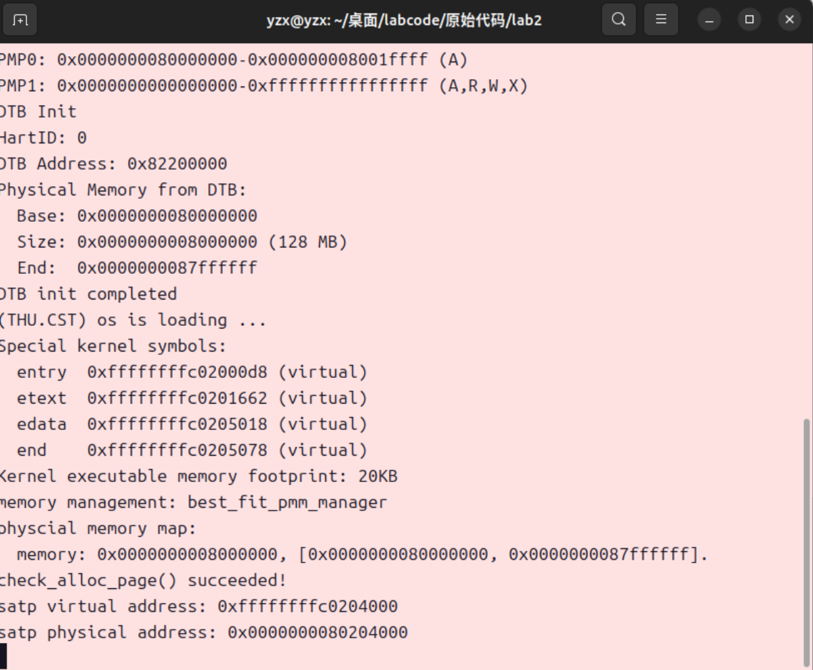
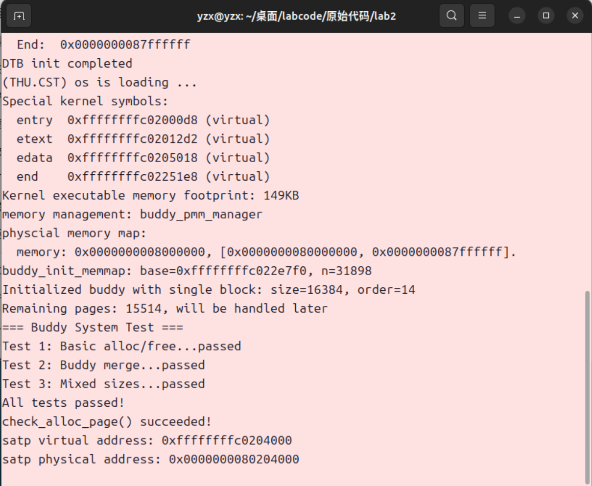

<h1 align='center'>  操作系统实验报告

<h2 align='center'>物理内存和页表

<h4 align='center'>信息安全		 2313781 李胜林	2312796 张肇秋	2312323 杨中秀

## 一、实验目的

- 理解页表的建立和使用方法
- 理解物理内存的管理方法
- 理解页面分配算法

## 二、实验练习

### 练习1：理解first-fit 连续物理内存分配算法

​	first-fit 连续物理内存分配算法作为物理内存分配一个很基础的方法，需要同学们理解它的实现过程。请大家仔细阅读实验手册的教程并结合`kern/mm/default_pmm.c`中的相关代码，认真分析default_init，default_init_memmap，default_alloc_pages， default_free_pages等相关函数，并描述程序在进行物理内存分配的过程以及各个函数的作用。 请在实验报告中简要说明你的设计实现过程。请回答如下问题：

- 你的first fit算法是否有进一步的改进空间？

### 练习2：实现 Best-Fit 连续物理内存分配算法

​	在完成练习一后，参考kern/mm/default_pmm.c对First Fit算法的实现，编程实现Best Fit页面分配算法，算法的时空复杂度不做要求，能通过测试即可。 请在实验报告中简要说明你的设计实现过程，阐述代码是如何对物理内存进行分配和释放，并回答如下问题：

- 你的 Best-Fit 算法是否有进一步的改进空间？

### 扩展练习Challenge：buddy system（伙伴系统）分配算法

​	Buddy System算法把系统中的可用存储空间划分为存储块(Block)来进行管理, 每个存储块的大小必须是2的n次幂(Pow(2, n)), 即1, 2, 4, 8, 16, 32, 64, 128

### 扩展练习Challenge：任意大小的内存单元slub分配算法

​	slub算法，实现两层架构的高效内存单元分配，第一层是基于页大小的内存分配，第二层是在第一层基础上实现基于任意大小的内存分配。可简化实现，能够体现其主体思想即可。

### 扩展练习Challenge：硬件的可用物理内存范围的获取方法

​	如果 OS 无法提前知道当前硬件的可用物理内存范围，请问你有何办法让 OS 获取可用物理内存范围？

## 三、练习解答

### （一）理解first-fit 连续物理内存分配算法

#### 1.程序在进行物理内存分配的过程

##### （1）初始化阶段

​	在系统启动时，调用初始化空闲链表和建立初始可用物理内存映射的函数。

##### （2）内存分配过程

​	首先检查内存分配请求是否合法，如果请求的页数超过可用的总数，就会直接调用失败。随后顺序检索空闲的链表，当找到第一个大小足够的块的时候就停止。接着分配检索到的内存块，将符合条件的第一个内存块从链表中移出，然后将这个块中需要使用的大小分割出来，将剩下的块作为新的空闲块，插入空闲块表中。最后更新空闲页的个数，返回分配页的指针。

##### （3）内存释放过程

​	首先进行页面的验证和重置，我们要确定页面的状态，将其所有的标志都清除，将引用计数归零。随后设置被释放块的属性，设置块的大小、将其标志位空闲块的首页，增加空闲页的计数。接着按照地址顺序将释放的块插入空闲块链表中，然后检查这个新插入的块是否与前后块相邻，如果相邻则将块合并，否则，不进行合并操作。

#### 2.重要函数的作用

##### default_init

​	初始化空闲内存块链表，并将空闲链表计数`nr_free`设置为0。

##### default_init_memmap

​	初始化从 base 开始的 n 个连续物理页，按低地址在前的顺序将空闲块插入链表。

##### default_alloc_pages

​	从链表头部开始扫描，找到第一个大小 ≥ n 的空闲块，如果找到的块大于需求，进行分割，将前n页用于分配，剩余部分作为新空闲块更新空闲页面计数`nr_free`。

##### default_free_pages

​	释放从 base 开始的 n 个连续页，然后按地址顺序将释放的块插入链表，最后尝试与前后相邻的空闲块合并。

### （二）实现 Best-Fit 连续物理内存分配算法

​	在这个部分，修改的代码主要是default_alloc_pages，在原来（FirstFit）的基础上，进行当前可使用空闲块与先前最小空闲块的比较，代码实现过程如下所示：

```c
/*LAB2 EXERCISE 2: 2312323*/ 
    // 下面的代码是first-fit的部分代码，请修改下面的代码改为best-fit
    // 遍历空闲链表，查找满足需求的空闲页框
    // 如果找到满足需求的页面，记录该页面以及当前找到的最小连续空闲页框数量

    while ((le = list_next(le)) != &free_list) {
        struct Page *p = le2page(le, page_link);
        if (p->property >= n && p->property < min_size) {
            page = p;
            min_size = p->property;
            //break;
        }
    }
```

​	其余部分的需要添加的代码与FirstFit一致，不需要进行修改。

```c
/*LAB2 EXERCISE 2: 2312323*/ 
        // 清空当前页框的标志和属性信息，并将页框的引用计数设置为0
        p->flags = p->property = 0;
        set_page_ref(p, 0);

/*LAB2 EXERCISE 2: 2312323*/ 
       // 编写代码
       // 1、当base < page时，找到第一个大于base的页，将base插入到它前面，并退出循环
       // 2、当list_next(le) == &free_list时，若已经到达链表结尾，将base插入到链表尾部
       if (base < page) {
           list_add_before(le, &(base->page_link));
           break;
       } else if (list_next(le) == &free_list) {
           list_add(le, &(base->page_link));
       }

/*LAB2 EXERCISE 2: 2312323*/ 
    // 编写代码
    // 具体来说就是设置当前页块的属性为释放的页块数、并将当前页块标记为已分配状态、最后增加nr_free的值
    base->property = n;
    SetPageProperty(base);
    nr_free += n;
    
/*LAB2 EXERCISE 2: 2312323*/ 
    // 编写代码
    // 1、判断前面的空闲页块是否与当前页块是连续的，如果是连续的，则将当前页块合并到前面的空闲页块中
    // 2、首先更新前一个空闲页块的大小，加上当前页块的大小
    // 3、清除当前页块的属性标记，表示不再是空闲页块
    // 4、从链表中删除当前页块
    // 5、将指针指向前一个空闲页块，以便继续检查合并后的连续空闲页块
    if (p + p->property == base) {
        p->property += base->property;
        ClearPageProperty(base);
        list_del(&(base->page_link));
        base = p;
    }
```

​	随后我们执行`make qemu`发现运行结果如下所示：



​	我们看到了`check_alloc_page() succeeded!`说明我们的BestFit算法是正确的。

​	此外，我们发现如果一直使用链表维护空白堆表的话，每次遍历最多都可能会遍历全部的元素，其时间复杂度为`O(n)`，我们可以通过使用堆的设计思路，将时间复杂度将为`O(logn)`。如果一直使用BestFit算法的话，会导致产生大量的小碎片，这些快大小太小，可能导致之后一直无法利用。针对这个情况，我们认为可以通过设置一个最小剩余块的大小，当大小大于这个最小剩余块时，才能进行分配与分割。

### （三）buddy system（伙伴系统）分配算法

​	Buddy System算法把系统中的可用存储空间划分为存储块(Block)来进行管理, 每个存储块的大小必须是2的n次幂。

#### buddy_pmm.h

```c
#ifndef __KERN_MM_BUDDY_PMM_H__
#define __KERN_MM_BUDDY_PMM_H__

#include <pmm.h>

extern const struct pmm_manager buddy_pmm_manager;

#endif /* !__KERN_MM_BUDDY_PMM_H__ */
```

​	这里，我们设置`buddy_pmm.h`的头文件如上所示，这个头文件与`best_fit_pmm.h`等相似，都是进行一些定义以及引用外部头文件。

#### buddy_pmm.c

​	在这个文件中，我们与`best_fit_pmm.c`类似，主要是设计四个分配释放函数以及一个测试函数。

##### 一些属性定义及初始化函数

```c
#include <pmm.h>
#include <list.h>
#include <string.h>
#include <stdio.h>
#include <buddy_pmm.h>
//伙伴系统支持的最大阶数，2^15 = 32768页
#define BUDDY_MAX_ORDER       15
#define MAX_BUDDY_PAGES       (1 << BUDDY_MAX_ORDER)
//每个阶数对应的空闲区域，free_area[i]管理大小为2^i的内存块
static free_area_t free_area[BUDDY_MAX_ORDER + 1];
//删除错误的宏定义
// #define nr_free (free_area->nr_free)
//记录每个物理页的阶数
static int buddy_order[MAX_BUDDY_PAGES];
//记录伙伴系统的内存基址
static struct Page *buddy_base;
//判断一个数是否是2的幂次方
static inline int
is_power_of_2(size_t n) {
    return (n & (n - 1)) == 0;
}
//将一个数向上取整为最近的2的幂次方
static inline size_t
round_up_power_of_2(size_t n) {
    size_t ret = 1;
    while (ret < n) {
        ret <<= 1;
    }
    return ret;
}
//计算满足大小为n的内存块所需的阶数,既满足2^order>=n
static int
get_order(size_t n) {
    int order = 0;
    size_t size = 1;
    while (size < n) {
        order++;
        size <<= 1;
    }
    return order;
}
//获取空闲页面的总数
static size_t
buddy_nr_free_pages(void) {
    size_t total = 0;
    for (int i = 0; i <= BUDDY_MAX_ORDER; i++) {
        total += free_area[i].nr_free;
    }
    return total;
}
```

##### buddy_init:初始化伙伴系统

```c
static void
buddy_init(void) {
    for (int i = 0; i <= BUDDY_MAX_ORDER; i++) {
        list_init(&free_area[i].free_list);//初始化链表
        free_area[i].nr_free = 0;//初始化空闲页数为0
    }
    memset(buddy_order, 0, sizeof(buddy_order));//初始化阶数数组
}
```

​	该函数是初始化伙伴系统，主要是初始化各个阶数对应的空闲表。

##### buddy_init_memmap：初始化物理页管理结构

```c
static void
buddy_init_memmap(struct Page *base, size_t n) {
    assert(n > 0);
    cprintf("buddy_init_memmap: base=%p, n=%d\n", base, n);   
    buddy_base = base;  //记录内存基址  
    //初始化所有页面属性
    struct Page *p = base;
    for (; p != base + n; p++) {
        assert(PageReserved(p));  //确保当前正在初始化的物理页p在进行管理前处于保留状态
        p->flags = 0;             //清除标志位
        SetPageProperty(p);       //将原本处于保留状态的物理页标记为可被伙伴系统管理的空闲页，使其能够参与后续的内存分配与释放过程。
        set_page_ref(p, 0);       //引用计数设为0
    }  
    //找到最大的2的幂次块，能够容纳n个页面
    int max_order = BUDDY_MAX_ORDER;
    while (max_order >= 0) {
        int block_size = (1 << max_order);  //1左移max_order位，即2^max_order个页面
        if (block_size <= n) {
            break;
        }
        max_order--;
    }  
    if (max_order < 0) {
        //如果n太小，使用最小块（1页）
        max_order = 0;
    }    
    int block_size = (1 << max_order);
    base->property = block_size;  //base是当前初始化的内存块的起始页指针，将前面计算得到的块大小存储到块的起始页的 property字段中。
    //设置块中所有页面的阶数
    for (int i = 0; i < block_size; i++) {
        buddy_order[i] = max_order;//将当前内存块中所有页面的阶数统一设置为max_order，这样buddy_order[0]-buddy_order[2^max_order]里就全设置为了max_order,表名这2^max_order个页面属于同一个2^max_order大小的块。
    }  
    //将块添加到对应阶数的空闲链表
    list_add(&free_area[max_order].free_list, &(base->page_link));
    /*
    第一个参数 &free_area[max_order].free_list,表示目标链表的头节点，即阶数为max_order的空闲块链表（伙伴系统中每种阶数都有独立的空闲链表）。第二个参数 &(base->page_link),表示要添加的节点，即当前初始化的内存块起始页base中的链表节点（page_link是struct Page 结构体中用于链表连接的成员）
    */
    free_area[max_order].nr_free += block_size;
    cprintf("Initialized buddy with single block: size=%d, order=%d\n", block_size, max_order);
    //如果有剩余页面，在这里简化处理
    if (block_size < n) {
        cprintf("Remaining pages: %d, will be handled later\n", n - block_size);
    }
}
```

​	该数用于初始化物理内存页的管理结构，它接收内存起始页地址和页面数量作为参数，首先将所有页面标记为可管理状态并重置引用计数，然后寻找能容纳这些页面的最大 2 的幂次方块，将其加入对应阶数的空闲链表，并记录块中每个页面的阶数，为后续的分配和释放操作奠定基础，对于剩余未处理的页面会给出提示。

##### buddy_alloc_pages：分配连续的物理页

```c
static struct Page *
buddy_alloc_pages(size_t n) {
    assert(n > 0); //保证传入的n是整数
    //检查请求是否超过最大支持页数
    if (n > MAX_BUDDY_PAGES) {
        return NULL;
    }    
    //计算需要的阶数
    int req_order = get_order(n);    
    //从req_order开始查找可用的块
    int current_order = req_order;
    while (current_order <= BUDDY_MAX_ORDER) {
        if (!list_empty(&free_area[current_order].free_list)) {
            //找到可用的块，获取链表中的第一个块
            list_entry_t *le = list_next(&free_area[current_order].free_list);
            struct Page *page = le2page(le, page_link);  //从链表项获取Page指针            
            //从空闲链表中移除该块
            list_del(le);
            free_area[current_order].nr_free -= (1 << current_order);            
            //如果块太大，需要分裂成更小的块
            while (current_order > req_order) {
                current_order--;
                int split_size = (1 << current_order);  //分裂后的块大小
                //计算伙伴块的位置（当前块地址 + split_size）
                struct Page *buddy = page + split_size;//以当前块（page）为起点，向后偏移split_size个页面的位置，这就是分裂后产生的伙伴块的起始地址。
                buddy->property = split_size;  //设置伙伴块的大小
                SetPageProperty(buddy);        //标记为空闲                
                //设置伙伴块中所有页面的阶数
                int page_idx = page - buddy_base;
                for (int i = 0; i < split_size; i++) {
                    buddy_order[page_idx + split_size + i] = current_order;//在将一个高阶块分裂为两个低阶子块后，为新产生的伙伴块中的所有页面设置正确的阶数，这里的是为后面那一块设置阶数。
                }          
                //将伙伴块加入对应阶数的空闲链表
                list_add(&free_area[current_order].free_list, &(buddy->page_link));
                free_area[current_order].nr_free += split_size;
            }        
            //标记为已分配
            ClearPageProperty(page);
            int page_idx = page - buddy_base; //计算当前物理页在整个伙伴系统管理范围内的索引位置。       
            //记录实际分配的大小，用于释放
            page->property = n;
            return page;
        }
        current_order++;  //尝试更大的阶数
    }
    //没有找到合适的块
    return NULL;
}
```

​	该函数负责分配指定数量的连续物理页，它先计算满足需求的最小阶数，从该阶数开始查找可用空闲块，若找到的块大于需求则不断分裂为更小的块，将分裂出的伙伴块加入对应阶数的空闲链表，最终返回符合需求的块并标记为已分配，若遍历所有可能阶数仍未找到可用块则返回空，确保分配操作高效且符合伙伴系统的块大小规则。

##### buddy_free_pages：释放物理页

```c
static void
buddy_free_pages(struct Page *base, size_t n) {
    assert(n > 0);    
    //计算页面索引和阶数
    int idx = base - buddy_base;
    int order = get_order(n);    
    //标记为未分配（空闲）
    SetPageProperty(base);
    base->property = (1 << order);  // 记录块大小    
    //设置释放块中所有页面的阶数
    for (int i = 0; i < (1 << order); i++) {
        buddy_order[idx + i] = order;
    }    
    //尝试合并伙伴块，从当前阶数向上合并
    while (order < BUDDY_MAX_ORDER) {
        //计算伙伴块的索引（异或操作可以找到伙伴）
        int buddy_idx = idx ^ (1 << order);
        /*
        仅翻转idx的第order位，其余位不变，这与伙伴块的索引特征相同，即仅第 order 位不同，其余位相同
        */
        struct Page *buddy = buddy_base + buddy_idx; //当前待释放块的伙伴块的起始页地址      
        //检查伙伴是否存在、空闲且大小相同
        if (buddy_idx >= 0 && PageProperty(buddy) && buddy_order[buddy_idx] == order) {
            //从链表中移除伙伴块
            list_del(&(buddy->page_link));
            free_area[order].nr_free -= (1 << order);            
            //合并：选择索引较小的作为新块的起始
            if (idx > buddy_idx) {
                idx = buddy_idx;
                base = buddy;
            }            
            //阶数加1，块大小翻倍
            order++;
            base->property = (1 << order);            
            //更新合并后块中所有页面的阶数
            for (int i = 0; i < (1 << order); i++) {
                buddy_order[idx + i] = order;
            }
        } else {
            //无法继续合并，退出循环
            break;
        }
    }    
    //将合并后的块加入对应阶数的空闲链表
    list_add(&free_area[order].free_list, &(base->page_link));
    free_area[order].nr_free += (1 << order);
}
```

​	该函数函数用于释放指定数量的物理页，它先计算待释放块的阶数并标记为空闲，然后通过异或操作寻找相邻的伙伴块，若伙伴块空闲且阶数相同则进行合并，合并过程可递归向上直到无法合并或达到最大阶数，最后将合并后的块加入对应阶数的空闲链表，通过合并操作减少内存碎片，维持伙伴系统的块管理结构。

##### buddy_check：测试函数

```c
static void
buddy_check(void) {
    cprintf("=== Buddy System Test ===\n");   
    size_t initial_free = buddy_nr_free_pages();    
    //测试1: 基本分配释放功能
    cprintf("Test 1: Basic alloc/free...");
    struct Page *p1 = buddy_alloc_pages(1);
    struct Page *p2 = buddy_alloc_pages(2);
    struct Page *p3 = buddy_alloc_pages(4);
    assert(p1 && p2 && p3);  // 确保分配成功    
    //释放页面
    buddy_free_pages(p1, 1);
    buddy_free_pages(p2, 2);
    buddy_free_pages(p3, 4);
    //检查释放后空闲页数是否恢复
    assert(buddy_nr_free_pages() == initial_free);
    cprintf("passed\n");    
    //测试2: 伙伴合并功能
    cprintf("Test 2: Buddy merge...");
    struct Page *a1 = buddy_alloc_pages(1);
    struct Page *a2 = buddy_alloc_pages(1);  // a1和a2应该是伙伴    
    //释放后应该合并成一个2页的块
    buddy_free_pages(a1, 1);
    buddy_free_pages(a2, 1);    
    //检查是否能分配到2页的块
    struct Page *merged = buddy_alloc_pages(2);
    assert(merged != NULL);
    buddy_free_pages(merged, 2);
    cprintf("passed\n");   
    //测试3: 混合大小分配
    cprintf("Test 3: Mixed sizes...");
    struct Page *m1 = buddy_alloc_pages(1);
    struct Page *m2 = buddy_alloc_pages(3);  // 实际分配4页（2^2）
    struct Page *m3 = buddy_alloc_pages(8);
    assert(m1 && m2 && m3);    
    //释放并检查
    buddy_free_pages(m1, 1);
    buddy_free_pages(m2, 3);
    buddy_free_pages(m3, 8);
    assert(buddy_nr_free_pages() == initial_free);
    cprintf("passed\n");    
    cprintf("All tests passed!\n");
}
```

​	该函数主要用于测试buddy_fit的可行性，其运行结果如下：



​	说明该程序可以正确运行。

#### （四）任意大小的内存单元slub分配算法


### （五）硬件的可用物理内存范围的获取方法